# PodBay Architecture

> **Version**: 3.0.0
> **Last Updated**: 2026-03-19

PodBay is a runtime injection framework for Electron applications. It patches Electron's ASAR bundles to inject a minimal **bootstrap** into every renderer window, connects those windows to an MCP broker, and delivers composable plugin bundles ("pods") on demand via the `execute_plugin` tool. The entire system runs as Docker containers communicating over WebSocket and HTTP.

---

## Table of Contents

1. [System Overview](#system-overview)
2. [Core Concepts](#core-concepts)
3. [Module Reference](#module-reference)
4. [Injection Lifecycle](#injection-lifecycle)
5. [Pod & Plugin System](#pod--plugin-system)
6. [Broker Communication](#broker-communication)
7. [Client-Side Plugin Architecture](#client-side-plugin-architecture)
8. [Docker Infrastructure](#docker-infrastructure)
9. [Dashboard & Web UI](#dashboard--web-ui)
10. [Tool Registry](#tool-registry)

---

## System Overview

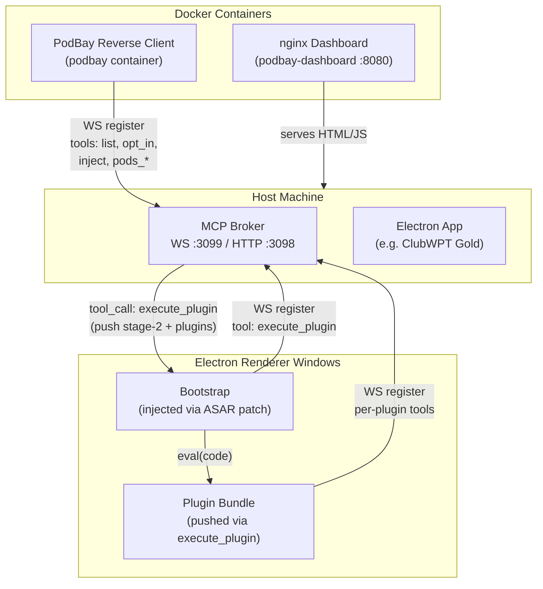

---

## Core Concepts

### 1. Opt-In / Opt-Out Model

PodBay never modifies applications without consent. An explicit **opt-in** step patches the Electron app's ASAR archive with a minimal bootstrap. **Opt-out** restores the original backup.

Opt-in state is tracked in `.opted-in.json` (name → ASAR path only). Pod assignments are tracked separately in `pods/app-pods.json`.

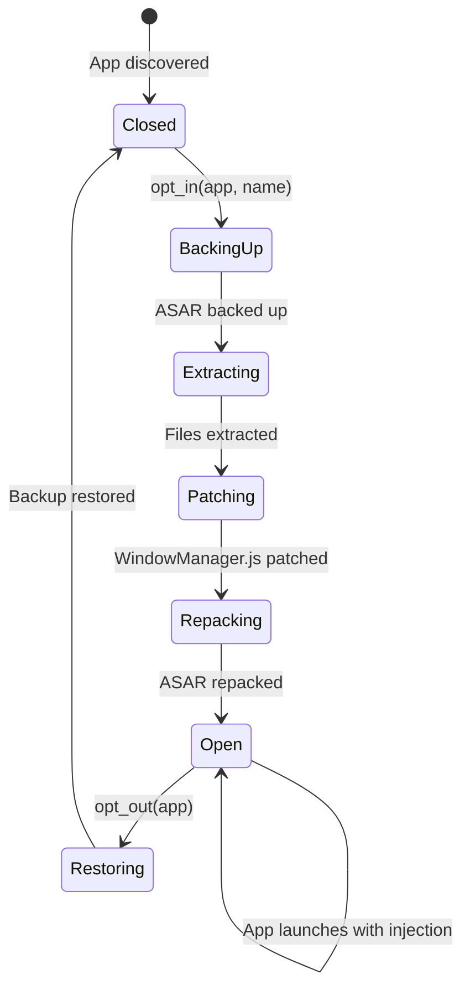

| State | Meaning |
|-------|---------|
| Closed | Original app, no PodBay involvement |
| Open | ASAR patched, bootstrap injected on every window load |

### 2. Reverse Client Pattern

PodBay acts as a **reverse client** — instead of exposing an API, it **publishes tools** to the MCP broker. External consumers (AI agents, dashboards, other clients) invoke PodBay operations through the broker's tool routing.

### 3. Pod Composition

Plugins are grouped into **pods** — JSON manifest files (`.pod`) that declare ordered plugin chains. Pods are assigned to applications, and on injection the assigned pods' plugins are bundled into a single executable payload.

### 4. Plugin Execution Order

Within a pod, plugins execute **top-to-bottom** in declaration order. This enables a layered dependency model:

```
broker-client-sdk → bridge → hook → identity → [domain plugins] → console-bridge
```

Each layer builds on the previous one's `window.*` exports.

### 5. Minimal Bootstrap Injection

The bootstrap (`lib/bootstrap.js`, ~95 lines) is the only code injected into the ASAR. Its sole responsibility is:
1. Derive a stable `clientId`
2. Connect to the broker via WebSocket
3. Register a single tool: `execute_plugin`
4. Handle incoming `tool_call` messages (eval arbitrary JS)
5. Reconnect on disconnect

All other capabilities (plugin registry, tool publishing, status reporting, pod loading) are **pushed** by the broker via `execute_plugin` after the bootstrap connects. This minimizes the ASAR patch surface and makes the injected code trivially simple.

---

## Module Reference

```mermaid
graph LR
    subgraph ServerSide["Server-Side (Node.js)"]
        index["index.js<br/>CLI & Core API"]
        rc["reverse-client.js<br/>Broker Reverse Client"]
        discover["lib/discover.js<br/>App Discovery"]
        asarMod["lib/asar.js<br/>ASAR Manipulation"]
        pods["lib/pods.js<br/>Pod Loader & Resolver"]
    end

    subgraph ClientSide["Client-Side (Browser Plugins)"]
        bs["lib/bootstrap.js<br/>Minimal Bootstrap"]
        sp["lib/system-plugin.js<br/>Legacy (reference)"]
        bc["lib/broker-client.js<br/>Broker Client SDK"]]
        bridge["lib/bridge.js<br/>Bridge Factory"]
        hook["lib/hook.js<br/>Method Interceptor"]
        identity["lib/identity.js<br/>Window Identity"]
        consoleBridge["lib/console-bridge.js<br/>Console Bridge"]
        tableWatcher["lib/table-watcher.js<br/>Table Watcher"]
    end

    index --> discover
    index --> asarMod
    index --> pods
    rc --> index
    rc --> pods
    sp --> bridge
    sp --> bc
    consoleBridge --> bridge
    consoleBridge --> hook
    consoleBridge --> identity
```

### Server-Side Modules

| Module | File | Purpose |
|--------|------|---------|
| **Core API** | `index.js` | CLI interface, opt-in/opt-out, registry management |
| **Reverse Client** | `reverse-client.js` | Long-lived process that publishes 13 MCP tools to the broker |
| **App Discovery** | `lib/discover.js` | Scans filesystem for Electron apps containing `app.asar` |
| **ASAR Manipulation** | `lib/asar.js` | Backup, extract, patch WindowManager.js, repack |
| **Pod Loader** | `lib/pods.js` | Parse `.pod` files, resolve plugin code, manage `app-pods.json` |

### Client-Side Modules (Injected Plugins)

| Module | File | Window Global | Purpose |
|--------|------|---------------|---------|
| **Bootstrap** | `lib/bootstrap.js` | `window.__podBayInstalled` | Minimal payload — connects to broker, exposes `execute_plugin` |
| **System Plugin** | `lib/system-plugin.js` | *(legacy, reference only)* | Former full-featured bootstrap — preserved for reference |
| **Broker Client SDK** | `lib/broker-client.js` | `window.PodBayBrokerClient` | Reusable WS client class with tool publishing & notification API |
| **Bridge Factory** | `lib/bridge.js` | `window.PodBayBridge(id)` | High-level bridge factory — `addTool()`, `connect()`, `notify()` |
| **Hook** | `lib/hook.js` | `window.PodBayHook(target, methods, cb)` | Generalized method interception on any object |
| **Identity** | `lib/identity.js` | `window.PodBayIdentity` | CWG window type detection from URL params |
| **Console Bridge** | `lib/console-bridge.js` | *(composes bridge+hook)* | eval/get_console/run_console tools + console hook notifications |
| **Table Watcher** | `lib/table-watcher.js` | `window.PodBayTableWatcher` | Cocos2d scene graph extraction for poker table state |
| **Portal Payload** | `lib/portal-payload.js` | `window.__portal` | Legacy v1 portal (includes require polyfill, plugin list via localStorage) |

---

## Injection Lifecycle

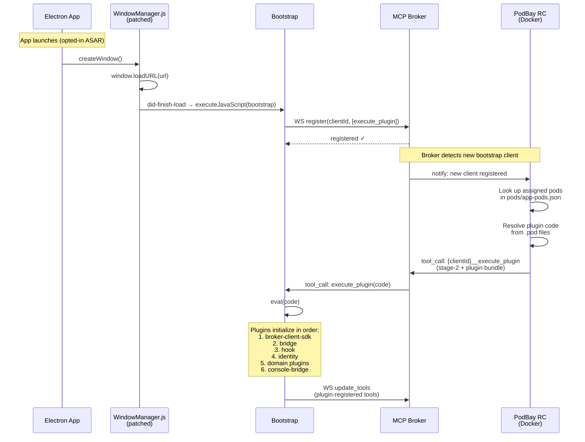

### Step-by-Step

1. **App Launch**: Electron loads the patched ASAR containing the bootstrap (`podbay-portal.js`)
2. **Window Creation**: `WindowManager.js` fires the patch on `did-finish-load`, injecting the bootstrap via `executeJavaScript()`
3. **Broker Registration**: Bootstrap connects to broker WS (`:3099`), registers only `execute_plugin`
4. **Plugin Push**: PodBay reverse client detects the new client, looks up its pods in `pods/app-pods.json`, resolves plugin code, and pushes the bundle via `execute_plugin`
5. **Bundle Evaluation**: Bootstrap evaluates the pushed code with `new Function(code)()`
6. **Plugin Initialization**: Each plugin IIFE runs in declaration order, installing its `window.*` export
7. **Tool Publishing**: Plugins that register broker tools trigger an `update_tools` message with the expanded tool list

---

## Pod & Plugin System

### Pod File Format

Pods are JSON files in the `pods/` directory with `.pod` extension:

```json
{
  "name": "console",
  "description": "Remote JavaScript console",
  "plugins": [
    {
      "type": "broker-client-sdk",
      "file": "lib/broker-client.js",
      "description": "Broker client SDK"
    },
    {
      "type": "custom-inline",
      "code": "(function(){ /* inline JS */ })()",
      "description": "Inline plugin"
    }
  ]
}
```

### Plugin Resolution

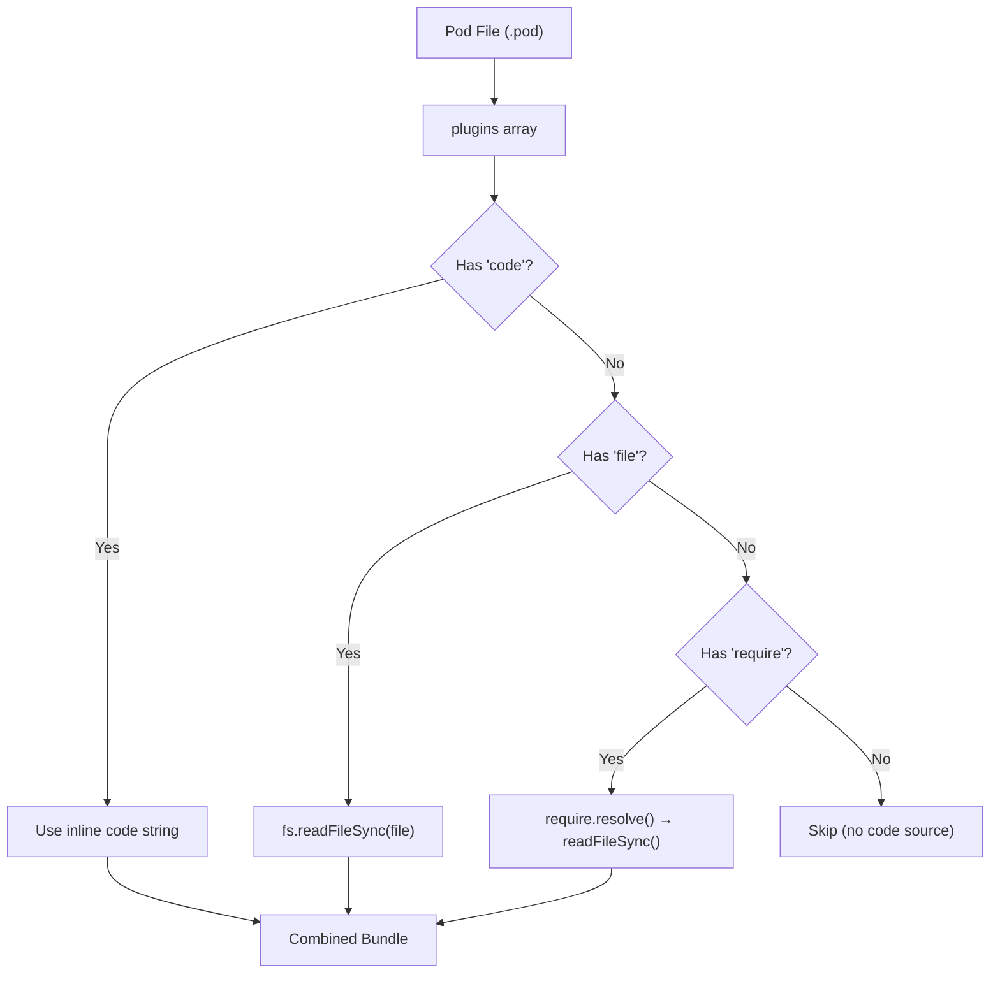

Three plugin code sources (checked in priority order):
1. **`code`** — inline JavaScript string embedded in the pod
2. **`file`** — path to a `.js` file read from disk at injection time
3. **`require`** — Node.js module resolved and read from disk

### Pod-to-App Assignment

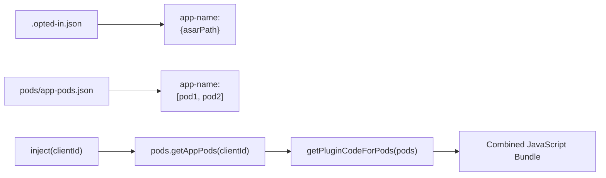

Opt-in state and pod assignments are **separated concerns**:

`.opted-in.json` — only tracks whether an app is bootstrapped:
```json
{
  "clubwpt-desktop": {
    "asarPath": "C:\\Users\\...\\clubwpt-desktop\\resources\\app.asar"
  }
}
```

`pods/app-pods.json` — maps app names to their assigned pods:
```json
{
  "clubwpt-desktop": ["console.pod", "cwg-debug.pod"]
}
```

---

## Broker Communication

### Protocol Overview

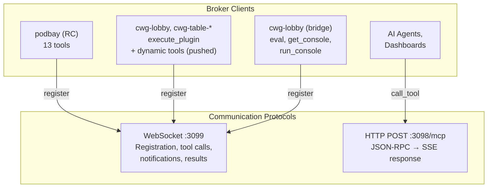

### WebSocket Message Types

| Type | Direction | Purpose |
|------|-----------|---------|
| `register` | Client → Broker | Register clientId + tools + metadata |
| `registered` | Broker → Client | Acknowledge registration |
| `tool_call` | Broker → Client | Execute a tool with arguments |
| `tool_result` | Client → Broker | Return tool execution result |
| `update_tools` | Client → Broker | Update tool list after plugin registration |
| `notification` | Client → Broker | Push event data (console logs, state changes) |

### Tool Namespacing

The broker namespaces tools as `{clientId}__{toolName}` (double underscore). A tool `eval` registered by client `cwg-lobby` becomes `cwg-lobby__eval` in the broker's global tool registry.

### Reconnection Strategy

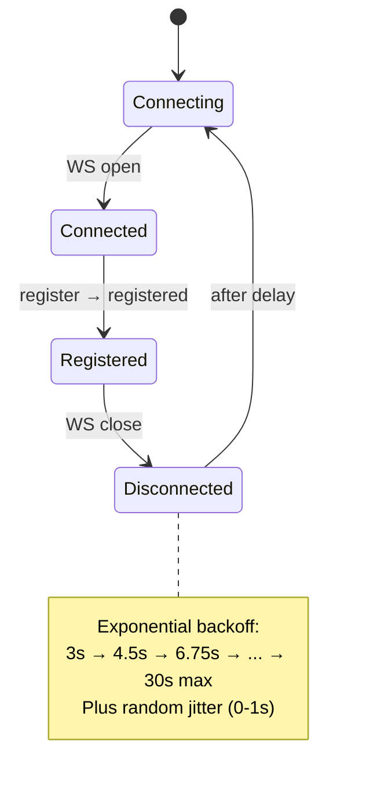

---

## Client-Side Plugin Architecture

### Plugin Pattern

Every client-side plugin follows the same IIFE pattern:

```javascript
;(function () {
  'use strict';

  // 1. Duplicate guard — prevent re-execution
  if (window.MyPlugin) return;

  // 2. Window-type guard (optional) — skip irrelevant windows
  var params = new URLSearchParams(window.location.search);
  if (params.get('windowType') === '1') return;  // skip lobby

  // 3. Plugin logic
  // ...

  // 4. Export to window
  window.MyPlugin = { /* public API */ };
})();
```

### Plugin Dependency Chain

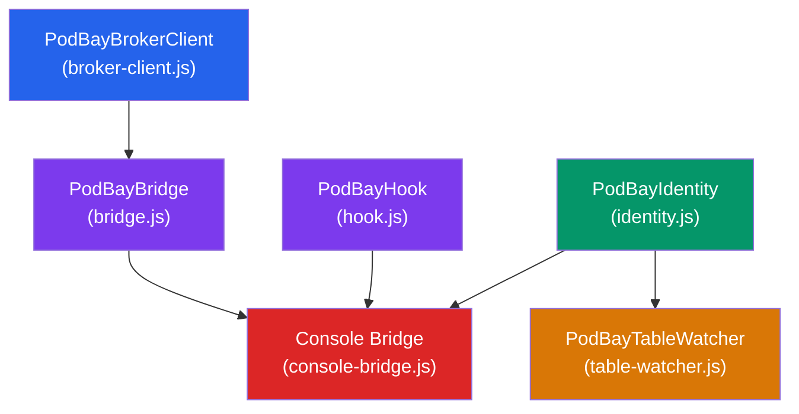

| Layer | Module | Depends On | Provides |
|-------|--------|------------|----------|
| 1 | Broker Client SDK | *(none)* | `window.PodBayBrokerClient` class |
| 2 | Bridge | Broker Client SDK | `window.PodBayBridge(clientId)` factory |
| 3 | Hook | *(none)* | `window.PodBayHook(target, methods, cb)` |
| 4 | Identity | *(none)* | `window.PodBayIdentity` object |
| 5 | Table Watcher | *(none, requires `cc`)* | `window.PodBayTableWatcher` |
| 6 | Console Bridge | Bridge, Hook, Identity | Broker tools: eval, get_console, run_console |

### Identity System

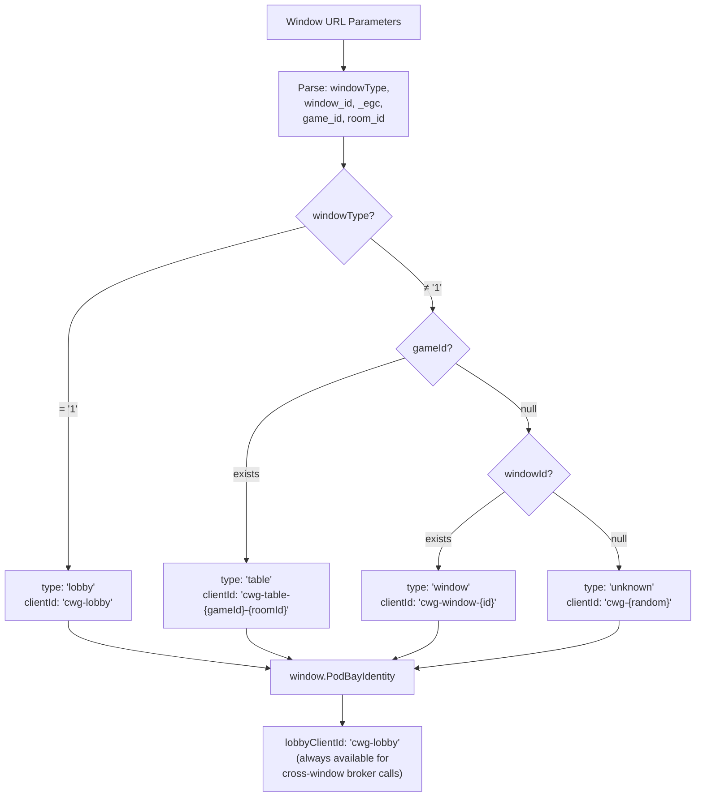

### Bridge Factory

The bridge factory provides a high-level API that composes `PodBayBrokerClient`:

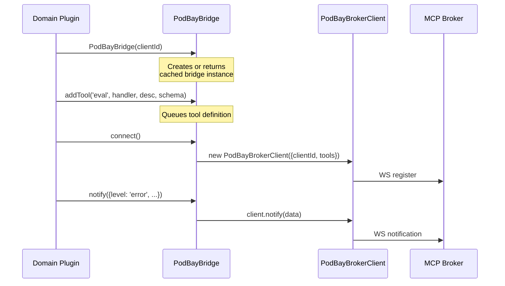

### Hook Mechanism

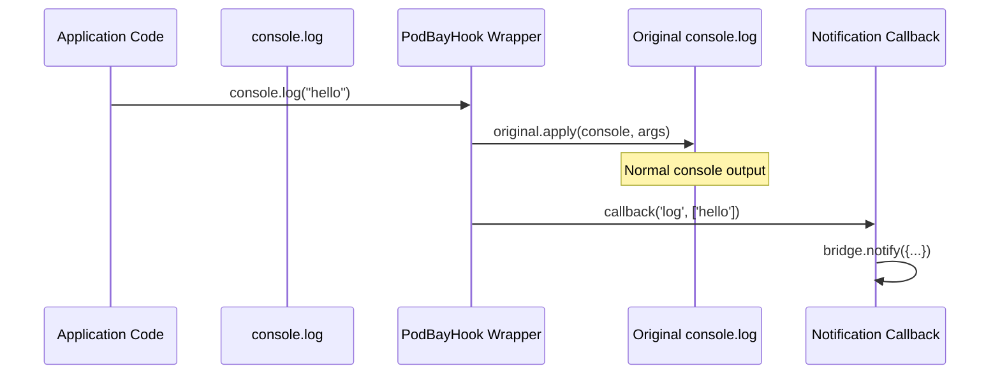

---

## Docker Infrastructure

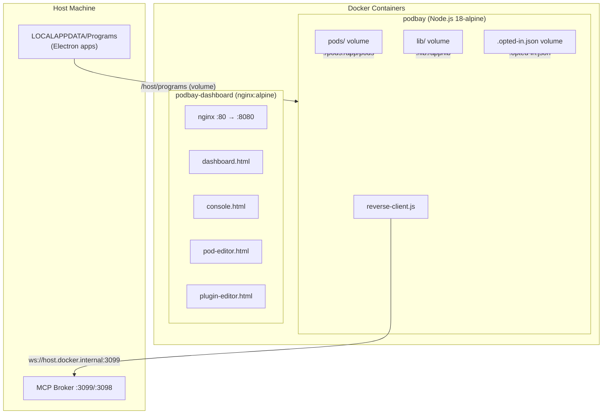

### Volumes

| Host Path | Container Path | Mode | Purpose |
|-----------|---------------|------|---------|
| `${LOCALAPPDATA}/Programs` | `/host/programs` | rw | Electron app discovery & ASAR patching |
| `./pods` | `/app/pods` | rw | Pod file persistence |
| `./lib` | `/app/lib` | rw | Live plugin code updates without rebuild |
| `./.opted-in.json` | `/app/.opted-in.json` | rw | Opt-in registry persistence |
| `./nginx.conf` | `/etc/nginx/conf.d/default.conf` | ro | nginx configuration |
| `./dashboard.html` | `.../index.html` | ro | Dashboard UI |
| `./console.html` | `.../console.html` | ro | Remote console UI |
| `./pod-editor.html` | `.../pod-editor.html` | ro | Pod editor UI |
| `./plugin-editor.html` | `.../plugin-editor.html` | ro | Plugin editor UI |

### Environment Variables

| Variable | Default | Purpose |
|----------|---------|---------|
| `PODBAY_BROKER_URL` | `ws://localhost:3099` | Broker WebSocket URL (overridden to `ws://host.docker.internal:3099` in Docker) |
| `PODBAY_SEARCH_ROOTS` | *(none)* | Additional directories to scan for Electron apps |

---

## Dashboard & Web UI

The dashboard system is served by the `podbay-dashboard` nginx container on port `8080`.

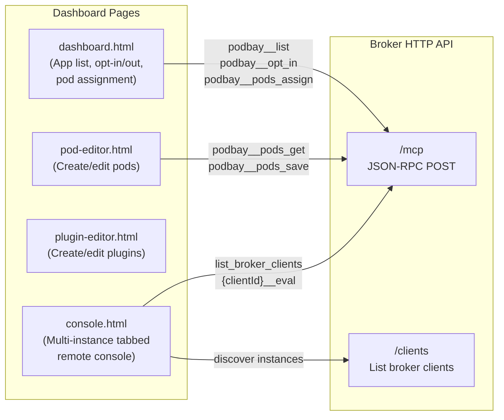

### Console Page Architecture

The console page provides a tabbed multi-instance remote JavaScript console:

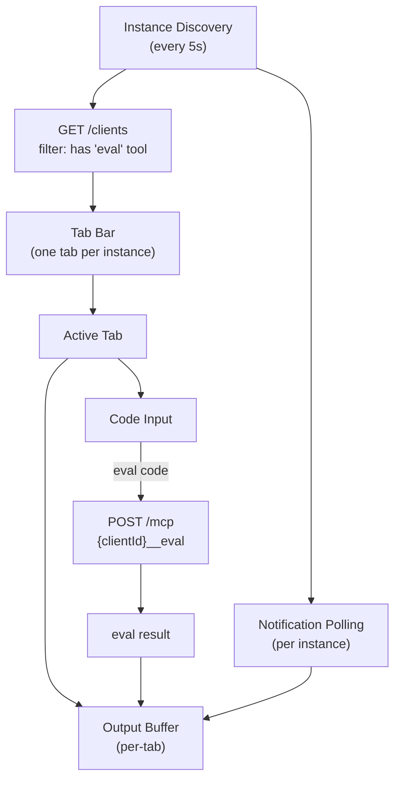

---

## Tool Registry

### PodBay Reverse Client Tools (13 tools)

| Tool | Description |
|------|-------------|
| `list` | Discover installed Electron apps with portal status |
| `opt_in` | Inject bootstrap via ASAR patch |
| `opt_out` | Restore original ASAR from backup |
| `status` | Get portal status for an app |
| `rename` | Rename an opted-in app |
| `inject` | Return combined plugin bundle for a target app |
| `pods_list` | List all `.pod` files |
| `pods_get` | Get a single pod by filename |
| `pods_save` | Create or update a `.pod` file |
| `pods_delete` | Delete a `.pod` file |
| `pods_resolve` | Preview resolved plugin code for all pods |
| `pods_assign` | Assign a pod to an opted-in app |
| `pods_unassign` | Unassign a pod from an app |
| `pods_app` | List pods assigned to an app |

### Bootstrap Tool (per window)

| Tool | Description |
|------|-------------|
| `execute_plugin` | Execute arbitrary JavaScript in the renderer |

The bootstrap registers only `execute_plugin`. All additional tools (e.g., `plugin`, `eval`, `get_console`) are pushed by the broker via `execute_plugin` and registered dynamically by the injected plugins.

### Dynamic Plugin-Registered Tools (per window)

Plugins can register additional tools at runtime via `window.PodBayBrokerClient.upsertTool()` or through the Bridge API. These appear in the broker as `{clientId}__{toolName}`.

**Console Bridge** registers:
- `eval` — Evaluate JavaScript in page context
- `get_console` — Return console page URL
- `run_console` — Open console page in browser

---

## ASAR Patch Detail

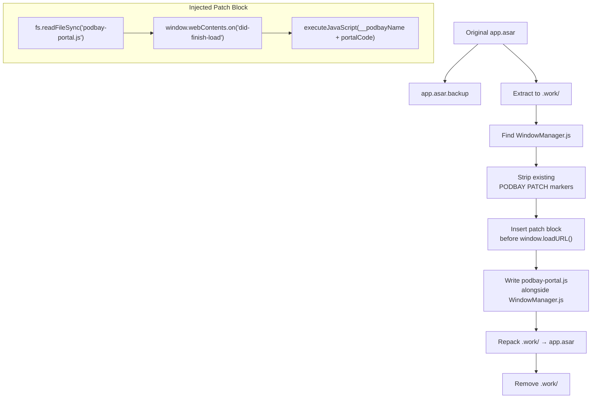

The patch adds a block between `// === PODBAY PATCH START ===` and `// === PODBAY PATCH END ===` markers in `WindowManager.js`. On every `did-finish-load` event, it reads the bootstrap file and executes it in the renderer context, optionally prefixing a `__podbayName` variable for client identification.

---

## Data Flow Summary

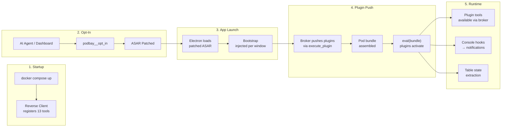
