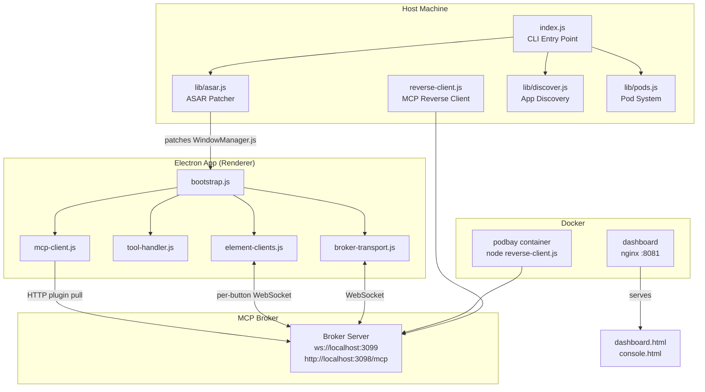
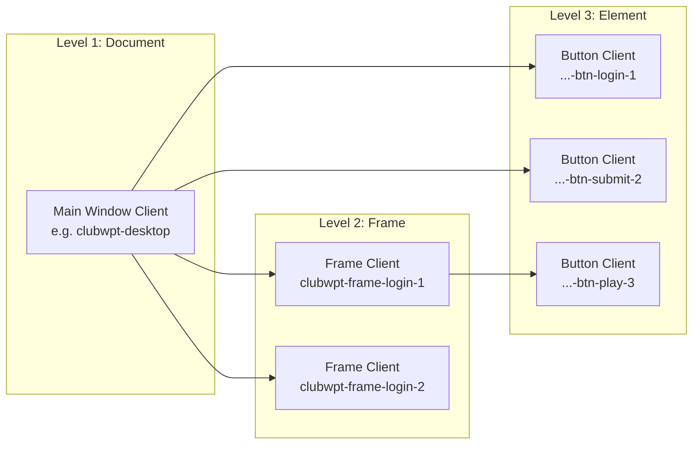
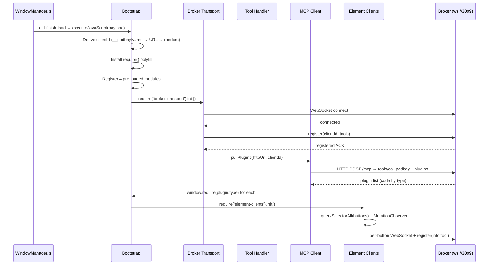
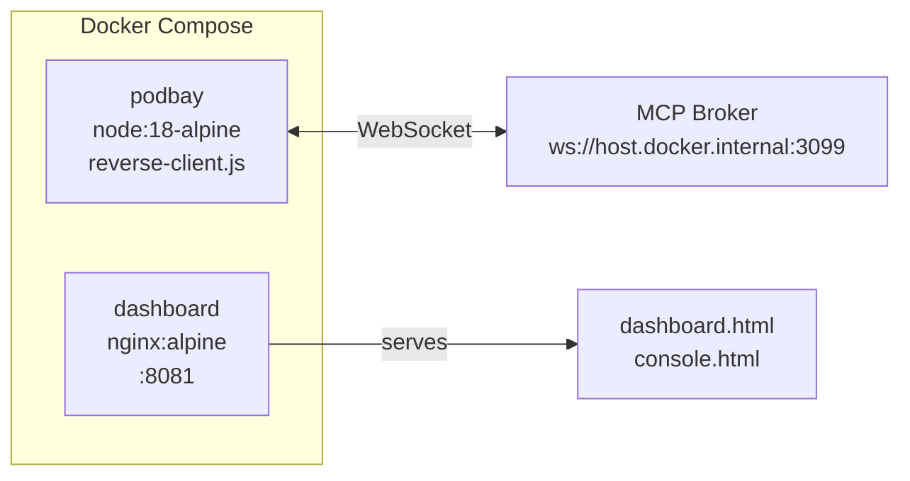
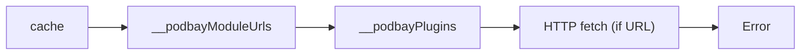
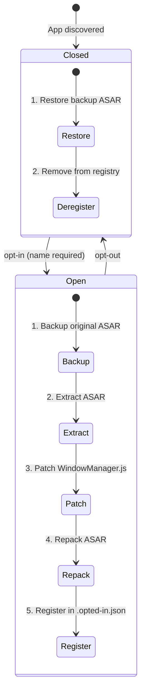
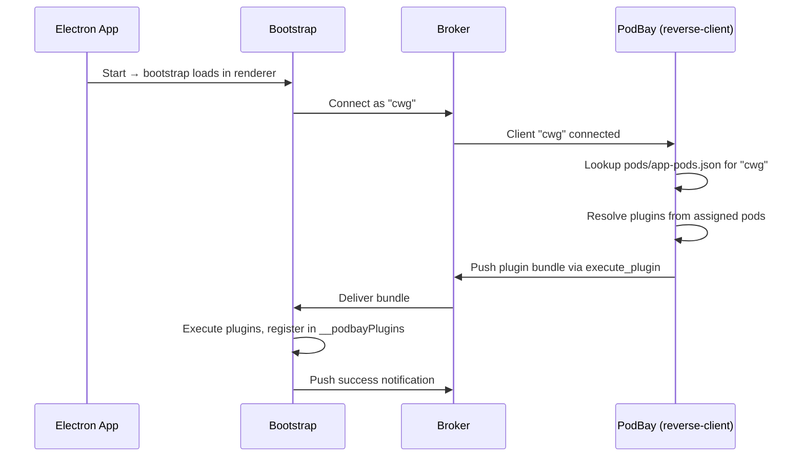

# PodBay

> "Open the pod bay doors, HAL." — Unlike HAL, PodBay always opens the doors.

Self-contained CLI that manages Electron app opt-in to the MCP broker and delivers plugins via `.pod` files. When opted-in with a **client name**, every renderer window registers on the broker using that name and exposes standard tools (`execute`, `info`, `inspect`) for remote interaction, plus per-element agent control for every button in the DOM.

**Two-stage injection model**: Opt-in patches the app's ASAR with a minimal **bootstrap** that only connects to the broker and registers tools. Everything else — plugin loading, tool registration, status reporting — is pulled from the broker after the bootstrap connects.

**Separated concerns** (decoupled data model):
- `.opted-in.json` — tracks which apps are bootstrapped (name → ASAR path only)
- `pods/app-pods.json` — maps app names to their assigned pod files (independent of opt-in state)

Pod files are app-agnostic — the same `.pod` file can be shared across multiple apps. Pod assignment does not require the app to be opted-in; pods can be pre-configured before bootstrap injection.

PodBay is **domain-agnostic** — it never embeds app-specific knowledge into client IDs or tool names. The caller chooses a name at opt-in time.

Supports three modes: interactive menu (default), scriptable CLI parameters, and MCP reverse client (publishes all operations as broker tools).

**Dashboard**: A web UI (nginx on `:8081`) provides app management, a remote JavaScript console, and a push activity log with real-time notifications.

See [ARCHITECTURE.md](ARCHITECTURE.md) for system design and [PLUGIN_MANUAL.md](PLUGIN_MANUAL.md) for per-plugin documentation.

## Architecture Overview



## Client Hierarchy

PodBay creates broker clients at three levels of granularity:



| Level | Detection | Client Naming | Tools |
|-------|-----------|---------------|-------|
| Document | `did-finish-load` | `__podbayName` or URL-derived | execute, info, inspect |
| Frame | `did-frame-navigate` + URL pattern match | `{pattern}-{counter}` | execute, info, inspect |
| Element | `MutationObserver` on `<button>`, `<input type="button\|submit">`, `[role="button"]` | `{parent}-btn-{text}-{counter}` | info |

## Bootstrap Sequence



## Pod Files

Pod files live in `pods/` and define collections of injectable plugins:

```json
{
  "name": "cwg-debug",
  "description": "ClubWPT Gold debug tools",
  "plugins": [
    {
      "type": "room-id",
      "description": "Displays room ID badge",
      "code": "console.log('hello')"
    },
    {
      "type": "helper",
      "description": "Table helper",
      "file": "plugins/helper.js"
    },
    {
      "type": "module",
      "description": "NPM module",
      "require": "some-module"
    }
  ]
}
```

Plugin resolution order: `require` (Node.js module) → `file` (read from disk) → `code` (inline JS). All are assembled into the final bundle in that order.

| Property | Description |
|----------|-------------|
| `type` | Plugin type name (used for `require()` registration) |
| `file` | Path(s) to source file(s) on disk |
| `code` | Inline JavaScript string(s) |
| `require` | Generate browser-side `require()` statements |
| `resolve` | Node.js `require.resolve()` to locate a file |
| `mandatory` | If true, fail-fast on load error |
| `cache` | If true, skip dynamic reload |
| `dashboard` | Dashboard UI configuration |

## Usage

### Interactive Mode

```bash
node index.js
```

1. Lists installed Electron apps with bootstrap status
2. Pick an app by number
3. Choose an action:
   - **1. Opt-In** — Inject bootstrap (prompts for client name)
   - **2. Opt-Out** — Restore original ASAR
   - **3. Rebuild** — Opt-out then opt-in (re-patch with latest code)
   - **4. Assign pods** — Toggle pod file assignments for the app

### CLI Parameters

```bash
# App discovery
node index.js list                                      # JSON array of all apps

# Opt-in management
node index.js opt-in clubwpt-desktop cwg                # Opt-in with name "cwg"
node index.js opt-out clubwpt-desktop                   # Restore original ASAR
node index.js rebuild clubwpt-desktop                   # Re-patch (opt-out + opt-in)
node index.js status clubwpt-desktop                    # Status + assigned pods

# Pod management
node index.js pods list                                 # List all pod files
node index.js pods get cwg-debug.pod                    # Get pod details
node index.js pods delete cwg-debug.pod                 # Delete a pod file
node index.js pods assign cwg cwg-debug.pod             # Assign pod to app
node index.js pods unassign cwg cwg-debug.pod           # Unassign pod from app
node index.js pods app cwg                              # List pods assigned to app
```

`<app>` can be a name or numeric index from `list`.

### Reverse Client (MCP Tools)

Run as a long-lived process that publishes all operations as tools on the broker:

```bash
npm start                                               # ws://localhost:3099
node reverse-client.js --url ws://myhost:3099           # custom broker
```

Registers as `podbay` on the broker with 16 tools:

| Tool | Description |
|------|-------------|
| `list` | Discover installed Electron apps with status and assigned pods |
| `opt_in` | Opt-in an app with a **required `name`** parameter |
| `opt_out` | Opt-out an app — restore original ASAR from backup |
| `status` | Get portal status and assigned pods for an app |
| `rename` | Rename a registered app's client name |
| `rebuild` | Full re-injection (opt-out + opt-in with latest code) |
| `inject` | Return combined injection bundle with `__podbayPlugins` registry |
| `pods_list` | List all `.pod` files in `pods/` |
| `pods_get` | Read a specific `.pod` file |
| `pods_save` | Create or update a `.pod` file |
| `pods_delete` | Delete a `.pod` file |
| `pods_resolve` | Preview resolved plugin code from all pods for an app |
| `pods_assign` | Assign a `.pod` file to an app |
| `pods_unassign` | Unassign a `.pod` file from an app |
| `pods_app` | List pods assigned to a specific app |
| `plugins` | Get resolved plugin list for a client (pull model) |

## Docker Deployment

### Quick Start

```bash
docker compose up -d
```

This starts two services:



| Service | Image | Port | Role |
|---------|-------|------|------|
| **podbay** | `node:18-alpine` (local build) | — | Reverse client: publishes 16 tools, patches apps |
| **dashboard** | `nginx:alpine` | `8081:80` | Web UI: dashboard + console viewer |

### Container Volumes

The `podbay` container mounts host directories for live access:

| Container Path | Host Path | Purpose |
|----------------|-----------|---------|
| `/host/programs` | `${LOCALAPPDATA}/Programs` | Electron app discovery |
| `/app/reverse-client.js` | `./reverse-client.js` | Live reload |
| `/app/index.js` | `./index.js` | CLI entry point |
| `/app/lib` | `./lib` | All library modules |
| `/app/.opted-in.json` | `./.opted-in.json` | Opt-in registry |
| `/app/pods` | `./pods` | Pod definitions |
| `/app/plugins` | `./plugins` | Plugin source code |

### Environment Variables

| Variable | Default | Description |
|----------|---------|-------------|
| `PODBAY_BROKER_URL` | `ws://host.docker.internal:3099` | Broker WebSocket endpoint |
| `PODBAY_SEARCH_ROOTS` | `/host/programs` | Where to scan for Electron apps |

### NPM Scripts

```bash
npm start                  # node reverse-client.js
npm run restart            # docker compose restart podbay
npm run rebuild:image      # docker compose up -d --build
npm run rebuild:app        # restart container + rebuild ASAR for clubwpt-desktop
```

### Dashboard

The `dashboard` nginx service serves two web interfaces on port **8081**:

- **`dashboard.html`** — App discovery, opt-in/out controls, pod assignment, push activity log
- **`console.html`** — Real-time console output from injected apps with tab-based frame switching

Nginx is configured with cache-busting headers (`no-cache, no-store, must-revalidate`) and CORS (`Access-Control-Allow-Origin: *`) for JavaScript files.

### Dockerfile

```dockerfile
FROM node:18-alpine
WORKDIR /app
COPY package.json ./
RUN npm install --production
COPY . .
CMD ["node", "reverse-client.js"]
```

Single dependency: `ws` (WebSocket client).

## Core Modules

### Bootstrap Modules (embedded in ASAR payload)

Four modules are assembled into the bootstrap payload at opt-in time and pre-registered in `window.__podbayModules`:

| Module | File | Purpose |
|--------|------|---------|
| `broker-transport` | `lib/broker-transport.js` | WebSocket connection, step notifications, reconnection with backoff |
| `tool-handler` | `lib/tool-handler.js` | Tool definitions (execute, info, inspect) and call dispatch |
| `mcp-client` | `lib/mcp-client.js` | HTTP plugin pull from broker MCP endpoint |
| `element-clients` | `lib/element-clients.js` | DOM observation, per-button broker clients |

### Host-Side Modules

| Module | File | Purpose |
|--------|------|---------|
| `asar` | `lib/asar.js` | ASAR backup, extract, patch WindowManager.js, repack, restore |
| `discover` | `lib/discover.js` | Scan Windows app directories for Electron apps |
| `pods` | `lib/pods.js` | Pod loading, plugin resolution (`require` → `file` → `code`), app-pod assignment |

## Standard Tools

Every document and frame client registers three tools:

### `execute`
Run arbitrary JavaScript in the renderer main world.
```json
{ "code": "document.title", "useIIFE": true }
```

### `info`
Returns bootstrap metadata: clientId, URL, title, Electron/Node/Chrome versions, iframe inventory, require cache stats, plugin registry, and full step audit trail.

### `inspect`
Opens/closes Chrome DevTools via console-message IPC bridge.
```json
{ "mode": "detach" }
```
Modes: `detach`, `right`, `bottom`, `close`.

## Plugin System

Plugins are first-class CommonJS modules that can `require()` each other by type name. Auto-registration via `window.__podbayPlugins` removes the need for manual `id` fields.

### Require Resolution Order



## Frame Injection

When a subframe navigates to a URL matching a pattern in `FRAME_CLIENTS`, PodBay injects the full bootstrap into that frame via `frame.executeJavaScript()`. The frame becomes an independent broker client with its own `execute`, `info`, and `inspect` tools.

```javascript
// index.js — Frame client configuration
const FRAME_CLIENTS = {
  'clubwptgold.com': 'clubwpt-frame-login',
};
```

Frame clients are named `{pattern}-{counter}` (e.g. `clubwpt-frame-login-1`) and tracked via `window.__podbayFrameClients` in the parent renderer.

## Element Clients

A `MutationObserver` watches for buttons added to or removed from the DOM. Each button gets its own dedicated WebSocket connection to the broker and registers an `info` tool that returns:

- `text`, `tagName`, `type`, `id`, `className`, `name`
- `disabled`, `visible`
- `rect` (bounding box: top, left, width, height)
- `dataAttributes`, `ariaLabel`, `title`
- `parentClient`, `url`, `timestamp`

Buttons are cleaned up automatically when removed from the DOM.

## Opt-In / Opt-Out Lifecycle



### Opt-In Flow

1. User opts-in an app with a name (e.g., `cwg`)
2. PodBay patches the ASAR to inject the bootstrap with `var __podbayName = "cwg"`
3. User assigns pod files to the app (e.g., `cwg-debug.pod`) — this can be done before or after opt-in

### Injection Flow (at app launch)



1. App starts → bootstrap loads in every renderer window
2. Bootstrap connects to broker as `cwg`
3. Bootstrap pulls plugins via `podbay__plugins` tool (or PodBay pushes automatically on client detection)
4. PodBay looks up which pods are assigned to `cwg` in `pods/app-pods.json`
5. PodBay resolves all plugins from those pods, bundles them
6. Bundle is returned and executed in the renderer
7. Push success/failure is logged and sent as a broker notification

### Name Rules

The `name` parameter must be lowercase alphanumeric + hyphens (`[a-z0-9-]`), no leading/trailing hyphens. Defaults to normalized app directory name (e.g., "ClubWPT Gold" → "clubwpt-gold"). Must be unique across opted-in apps.

## Step Notification System

Every operation logs a step entry `{ step, status, detail, ts }` with statuses: `ok`, `start`, `fail`, `skip`. Steps are sent to the broker as real-time notifications and available via the `info` tool's `steps` array.

## Public API

After bootstrap runs, `window.__podBay` is available in the renderer:

```javascript
window.__podBay.clientId          // This client's broker ID
window.__podBay.ws()              // Current WebSocket instance
window.__podBay.steps()           // Full step audit trail
window.__podBay.elementClients    // Element client module (getClients, getCount, scanForButtons)
```

## How It Works

```
podbay/
  index.js              ← CLI entry point + opt-in/opt-out + pod assignment + frame config
  reverse-client.js     ← Reverse client — publishes 16 tools on broker
  Dockerfile            ← Container image for reverse client
  docker-compose.yml    ← Docker orchestration (podbay + nginx dashboard)
  nginx.conf            ← Dashboard server config (cache-busting + CORS)
  dashboard.html        ← Main dashboard UI (app list, pods, push activity)
  console.html          ← Remote JavaScript console (multi-tab, per-frame)
  lib/
    asar.js             ← ASAR backup/extract/patch/repack/restore
    bootstrap.js        ← Minimal injection payload — broker connect + tool registration
    broker-transport.js ← WebSocket connection, step notifications, reconnection
    tool-handler.js     ← Tool definitions (execute, info, inspect) + dispatch
    mcp-client.js       ← HTTP plugin pull from broker MCP endpoint
    element-clients.js  ← DOM observation, per-button broker clients
    discover.js         ← Scan for installed Electron apps
    pods.js             ← Pod file CRUD and plugin resolution
  plugins/              ← Reusable plugin source files
    bridge.js           ← High-level broker bridge factory with addTool(), connect()
    hook.js             ← Generalized method interception on any object
    identity.js         ← CWG window type detection from URL params
    console-bridge.js   ← eval/get_console/run_console tools + console hook
    table-watcher.js    ← Cocos2d scene graph extraction (poker table state)
    greeting.js         ← Demo plugin
    cwg/                ← CWG-specific plugin modules
  pods/                 ← Pod files (.pod JSON files)
    app-pods.json       ← Maps app names → pod file arrays
  .opted-in.json        ← Registry: maps names → {asarPath}
```

## Walkthrough: Verify with ClubWPT Gold

### Prerequisites

- ClubWPT Gold Desktop installed (`%LOCALAPPDATA%\Programs\clubwpt-desktop`)
- ClubWPT Gold Desktop is **closed**
- MCP Broker running at `ws://localhost:3099`

### Step 1: Opt-In and Assign Pods

```bash
node index.js opt-in clubwpt-desktop cwg
node index.js pods assign cwg cwg-debug.pod
```

### Step 2: Launch ClubWPT Gold

Open the app. Every renderer window will:
- Load the bootstrap
- Connect to broker as `cwg`
- Pull plugins from PodBay
- Execute all plugins from `cwg-debug.pod`
- Register per-button element clients

### Step 3: Verify via Broker

```json
{
  "tool": "cwg__execute",
  "arguments": { "code": "return document.title" }
}
```

Expected: the app's document title.

### Step 4: Check Element Clients

After the app loads, button clients appear on the broker as `cwg-btn-{text}-{n}`. Call their `info` tool for metadata:

```json
{
  "tool": "cwg-btn-login-1__info",
  "arguments": {}
}
```

### Step 5: Re-patch After Code Changes

```bash
node index.js rebuild clubwpt-desktop
```

### Step 6: Opt-Out

```bash
node index.js opt-out clubwpt-desktop
```

The app is restored to its original state. Pod assignments in `app-pods.json` are preserved for next time.

## Quick Start

```bash
# Install
npm install

# Interactive mode
node index.js

# Or deploy via Docker
docker compose up -d

# Re-patch after code changes
node index.js rebuild clubwpt-desktop
```

Requires the MCP broker running on `ws://localhost:3099` (WS) and `http://localhost:3098/mcp` (HTTP).
