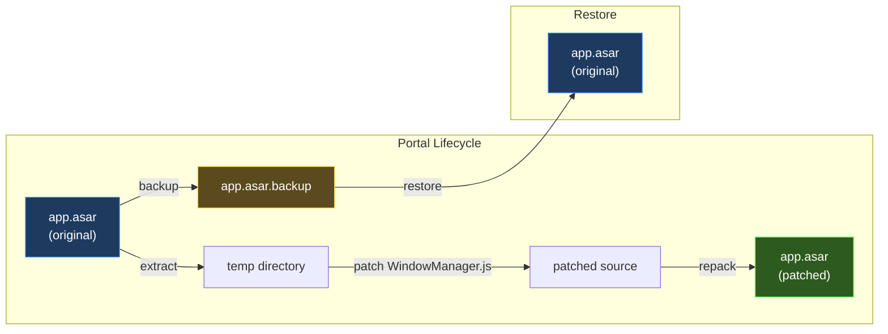
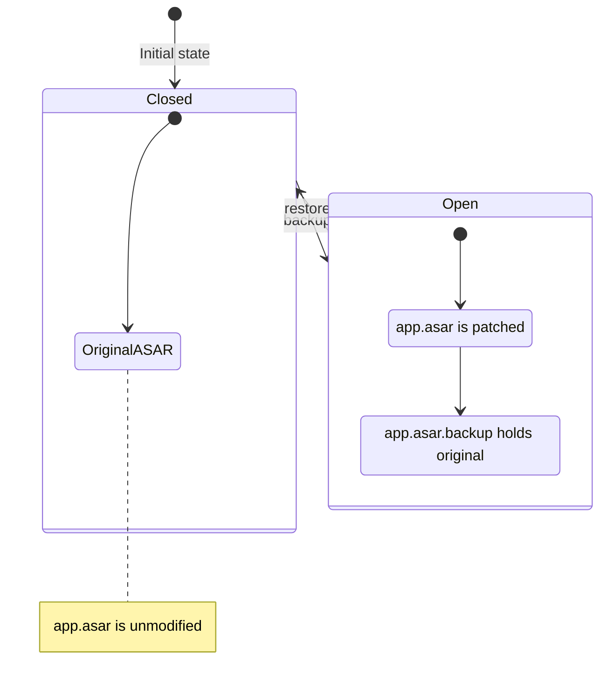
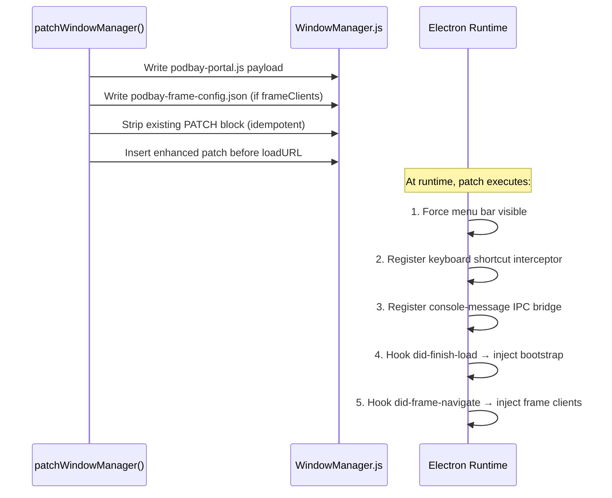
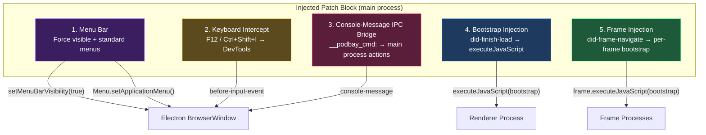
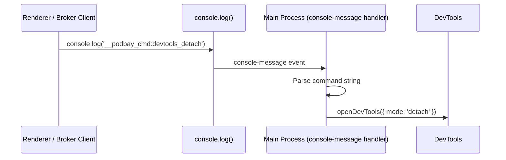
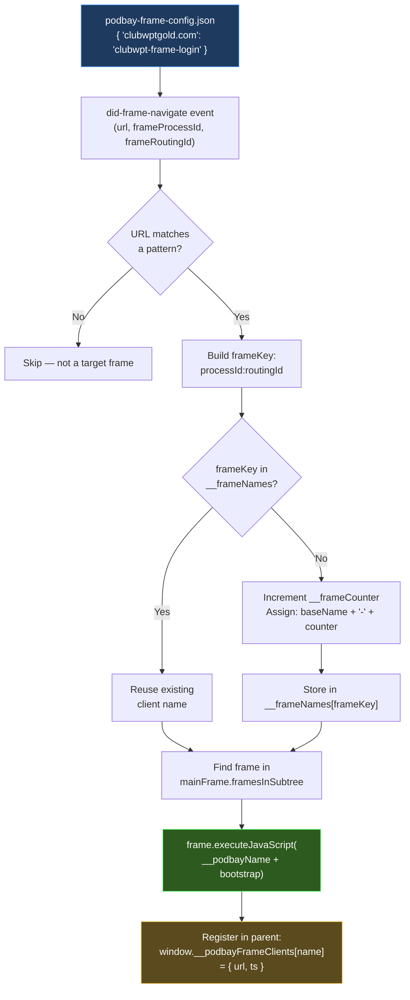

# asar.js (PodBay) — Developer's Guide

## Summary

The PodBay `asar.js` handles the **ASAR archive surgery** needed to inject PodBay's bootstrap into an Electron application. It manages the full lifecycle: backup the original archive, extract it, patch the app's `WindowManager.js`, repack, and (when done) restore the original.

The ASAR patch injects a comprehensive runtime block that:
1. **Forces the Electron menu bar visible** with standard DevTools access
2. **Intercepts DevTools keyboard shortcuts** (F12, Ctrl+Shift+I)
3. **Provides a console-message IPC bridge** for renderer→main commands
4. **Injects the PodBay bootstrap** into every renderer window
5. **Injects the bootstrap into matching iframes** as unique broker clients (frame injection system)

### What Changed from Original

| Aspect | Original `asar.js` | PodBay `asar.js` |
|--------|--------------------|--------------------|
| Portal lifecycle | Identical | Identical |
| Extract/repack | Identical | Identical |
| WindowManager patch | Injects payload + `did-finish-load` | Adds menu bar, keyboard intercept, IPC bridge, frame injection |
| DevTools access | Not addressed | F12 / Ctrl+Shift+I intercepted + console-message IPC commands |
| Frame support | None | Frames matching URL patterns get their own bootstrap + unique client name |

### Key Concepts

- **Portal Metaphor**: The ASAR patch creates a "portal" — either **open** (backup exists, app is patched) or **closed** (original restored).
- **Non-Destructive**: Always backs up the original ASAR before any modification.
- **Patch Markers**: Sentinel comments (`PODBAY PATCH START/END`) ensure idempotent patching — re-running the patch strips and replaces any existing block.
- **DevTools Guarantee**: Menu bar + keyboard shortcuts + IPC bridge ensure DevTools access is always available.
- **Frame Clients**: Cross-origin iframes matching configured URL patterns receive the full PodBay bootstrap and become independent broker clients.



---

## Detailed Implementation

### Portal Status, Backup & Restore

These are identical to the original. See [the original asar.js guide](../../../lib/docs/asar.md) for details.



### Extract, Repack & WindowManager Discovery

Also identical to the original — delegates to `npx asar extract/pack` with a 2-minute timeout, and checks two candidate paths for `WindowManager.js`.

### The Patch: `patchWindowManager()` (Enhanced)

```
patchWindowManager(dir, payloadContent, resourcesDir, name, frameClients)
```

| Parameter | Type | Description |
|-----------|------|-------------|
| `dir` | string | Extracted ASAR directory |
| `payloadContent` | string | Bootstrap payload JS content |
| `resourcesDir` | string | Path to the app's resources directory |
| `name` | string (optional) | Client name for system plugin registration |
| `frameClients` | object (optional) | Map of `{ urlPattern: clientBaseName }` for frame injection |

The function writes the payload to `podbay-portal.js`, optionally writes `podbay-frame-config.json`, strips any existing patch block, and injects an enhanced patch before the `window.loadURL(url)` anchor.



#### The Five Patch Responsibilities



**1. Force Menu Bar Visible**

```js
window.setMenuBarVisibility(true);
window.setAutoHideMenuBar(false);
Menu.setApplicationMenu(Menu.buildFromTemplate([
  { role: 'fileMenu' },
  { role: 'editMenu' },
  { role: 'viewMenu' },   // ← includes "Toggle Developer Tools"
  { role: 'windowMenu' }
]));
```

Many Electron apps hide the menu bar or use a custom menu that omits DevTools. The patch overrides this with standard Electron role-based menus, guaranteeing the `View > Toggle Developer Tools` option is always present. The `try/catch` wrapper ensures failures here don't block bootstrap injection.

**2. Keyboard Shortcut Interception**

```js
window.webContents.on('before-input-event', function (event, input) {
  if (input.key === 'F12' ||
      (input.control && input.shift && input.key.toLowerCase() === 'i')) {
    window.webContents.toggleDevTools();
    event.preventDefault();
  }
});
```

The `before-input-event` fires **before** the renderer process receives the key event. This means:
- Even if the app intercepts and suppresses `F12` in the renderer, this handler fires first
- `event.preventDefault()` stops the key from reaching the app at all
- DevTools toggle is guaranteed regardless of app-level key handling

**3. Console-Message IPC Bridge**

```js
window.webContents.on('console-message', function (event, level, message) {
  if (typeof message === 'string' && message.indexOf('__podbay_cmd:') === 0) {
    var cmd = message.substring('__podbay_cmd:'.length);
    if (cmd === 'devtools' || cmd === 'devtools_detach') {
      window.webContents.openDevTools({ mode: 'detach' });
    } else if (cmd === 'devtools_right') {
      window.webContents.openDevTools({ mode: 'right' });
    } else if (cmd === 'devtools_bottom') {
      window.webContents.openDevTools({ mode: 'bottom' });
    } else if (cmd === 'devtools_close') {
      window.webContents.closeDevTools();
    }
  }
});
```

The IPC bridge allows the renderer process (and any broker client via the `inspect` tool) to trigger main-process actions **without needing `ipcRenderer`**. The renderer sends commands via `console.log('__podbay_cmd:...')` and the main process intercepts them on the `console-message` event. This bypasses any app-level IPC restrictions.

| Command | Action |
|---------|--------|
| `__podbay_cmd:devtools` | Open DevTools (detached) |
| `__podbay_cmd:devtools_detach` | Open DevTools (detached) |
| `__podbay_cmd:devtools_right` | Open DevTools (docked right) |
| `__podbay_cmd:devtools_bottom` | Open DevTools (docked bottom) |
| `__podbay_cmd:devtools_close` | Close DevTools |



**4. Bootstrap Injection** (renderer)

```js
window.webContents.on('did-finish-load', function () {
  var __namePrefix = name ? 'var __podbayName = "' + name + '";\n' : '';
  window.webContents.executeJavaScript(__namePrefix + __portalCode);
});
```

Injects the bootstrap (with its embedded `require()` polyfill and modules) into every renderer window after its page finishes loading. If a `name` was provided, sets `__podbayName` so the bootstrap registers with the broker under that identity.

**5. Frame Injection System** (cross-origin iframes)

This is the most complex part of the patch. When `frameClients` is provided, the patch reads a `podbay-frame-config.json` at runtime and sets up a `did-frame-navigate` listener that injects the bootstrap into matching iframes.



**How frame naming works:**

Each frame gets a globally unique client name by combining the base name from `podbay-frame-config.json` with an incrementing counter:

```
clubwpt-frame-login-1   (first frame matching 'clubwptgold.com')
clubwpt-frame-login-2   (second frame matching same pattern)
```

The `__frameNames` map is keyed by `frameProcessId:frameRoutingId`, so if the same frame navigates again it keeps its assigned name. The `__frameCounter` only increments for genuinely new frames.

**Frame registry in the parent renderer:**

After injecting into a frame, the main process also registers the frame client in the parent renderer's `window.__podbayFrameClients` object:

```js
window.__podbayFrameClients['clubwpt-frame-login-1'] = {
  url: 'https://www.clubwptgold.com/login',
  ts: '2026-03-22T01:00:00.000Z'
};
```

This allows plugins running in the parent renderer (e.g., the login plugin) to discover frame clients and call their tools via the broker.

### Exports

| Export | Purpose |
|--------|---------|
| `status(asarPath)` | Check if portal is `'open'` or `'closed'` |
| `backup(asarPath)` | Create `.backup` of original ASAR |
| `restore(asarPath)` | Restore original ASAR from `.backup` |
| `extract(asarPath, dest)` | Unpack ASAR to directory |
| `repack(src, asarPath)` | Pack directory back to ASAR |
| `patchWindowManager(dir, payloadContent, resourcesDir, name, frameClients)` | Inject enhanced bootstrap + frame injection into WindowManager.js |
| `PATCH_START`, `PATCH_END` | Sentinel comment strings |
