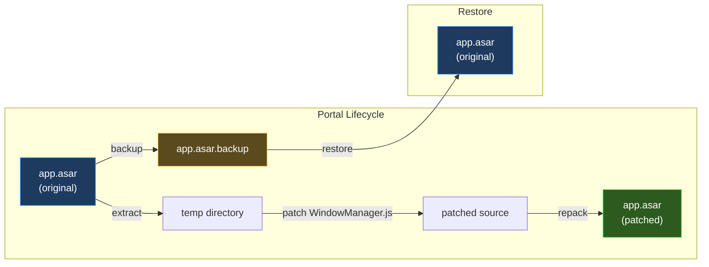
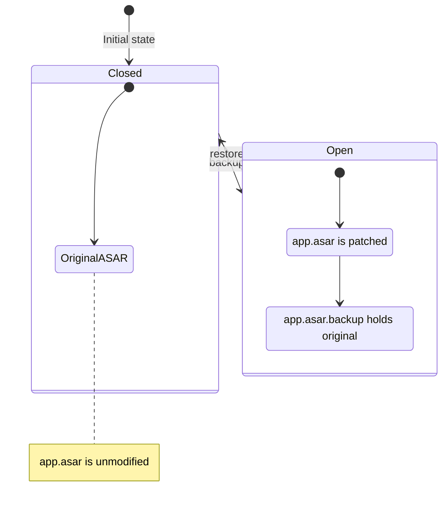
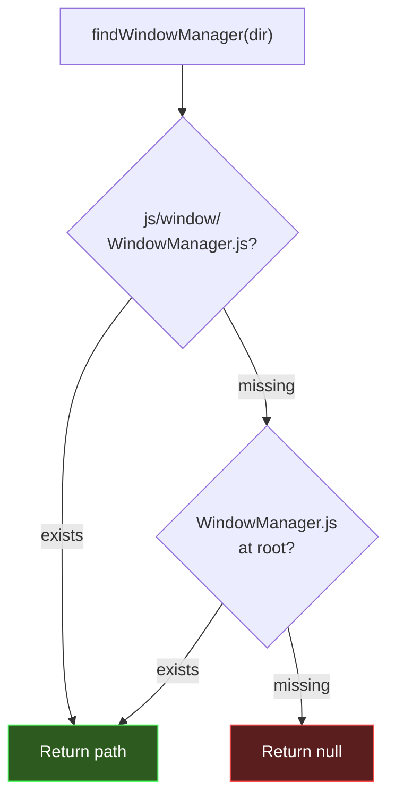
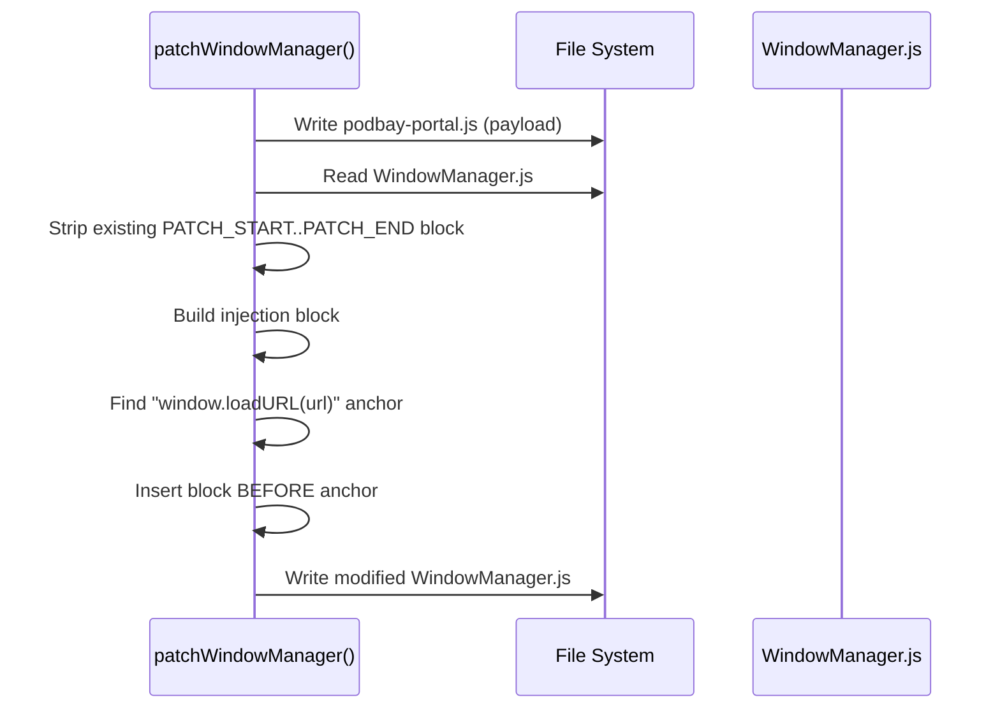

# asar.js — Developer's Guide

## Summary

`asar.js` is the **surgical instrument** that opens an Electron app for injection. It handles the full lifecycle of modifying an Electron application's `app.asar` archive — backup, extract, patch, repack, and restore.

Electron apps bundle their source code inside an [ASAR archive](https://github.com/electron/asar) (`app.asar`). To inject PodBay's bootstrap into every renderer window, the archive must be unpacked, its `WindowManager.js` patched to load a payload on every `did-finish-load` event, and then repacked. `asar.js` encapsulates this entire process behind clean, composable functions.

### Key Concepts

- **Portal Metaphor**: The ASAR patch is called a "portal" — it's either **open** (backup exists, app is patched) or **closed** (original restored).
- **Non-Destructive**: Always backs up the original ASAR before modification; restore reverts cleanly.
- **Patch Markers**: Uses sentinel comments (`PODBAY PATCH START/END`) to idempotently manage the injected block.
- **Single Injection Point**: Patches `WindowManager.js` to load one file (`podbay-portal.js`) — all plugin orchestration happens through the broker, not the patch.



---

## Detailed Implementation

### Portal Status

```js
function status(asarPath) {
  return fs.existsSync(backupPath(asarPath)) ? 'open' : 'closed';
}
```

The portal state is derived from a single signal: **does `app.asar.backup` exist?** If yes, the ASAR has been modified and the backup holds the original. If no, the app is in its stock state.

### Backup & Restore



- **`backup(asarPath)`** — Copies `app.asar` → `app.asar.backup`. Throws if backup already exists (prevents accidental double-backup of a patched file).
- **`restore(asarPath)`** — Copies `app.asar.backup` → `app.asar`, then deletes the backup. Throws if no backup found.

### Extract & Repack

```js
function extract(asarPath, dest) {
  if (fs.existsSync(dest)) fs.rmSync(dest, { recursive: true, force: true });
  execSync(`npx asar extract "${asarPath}" "${dest}"`, { stdio: 'pipe', timeout: 120000 });
}

function repack(src, asarPath) {
  execSync(`npx asar pack "${src}" "${asarPath}"`, { stdio: 'pipe', timeout: 120000 });
}
```

Both delegate to the `asar` CLI tool via `npx`. The 2-minute timeout accommodates large archives. Extract cleans the destination first to ensure a fresh unpack.

### WindowManager.js Discovery



Checks two candidate paths inside the extracted ASAR. Different Electron apps may structure their source differently, so both a nested and flat layout are supported.

### The Patch: `patchWindowManager()`

This is the core operation. It modifies `WindowManager.js` to inject PodBay's bootstrap code into every renderer window.



#### Step-by-step:

1. **Write payload file** — Saves the system plugin JavaScript as `podbay-portal.js` alongside `WindowManager.js`.

2. **Strip existing patch** — Removes any prior `PODBAY PATCH START`/`END` block to ensure idempotency. The while-loop handles edge cases where multiple patches exist.

3. **Build injection block** — Creates a self-executing function that:
   - Reads `podbay-portal.js` from disk at runtime (via Node.js `fs`)
   - Hooks into `window.webContents.on('did-finish-load', ...)`
   - Calls `executeJavaScript()` to inject the payload into the renderer
   - Optionally prefixes a `__podbayName` variable for client identity

4. **Anchor insertion** — Finds the `window.loadURL(url)` call and inserts the patch **immediately before** it. This ensures the `did-finish-load` listener is registered before navigation begins.

#### The Injected Block

```js
// === PODBAY PATCH START ===
(function () {
  var fs = require('fs');
  var path = require('path');
  var __portalCode = fs.readFileSync(
    path.join(__dirname, 'podbay-portal.js'), 'utf8'
  );
  window.webContents.on('did-finish-load', function () {
    var __namePrefix = 'clubwpt-desktop'
      ? 'var __podbayName = "clubwpt-desktop";\n' : '';
    window.webContents.executeJavaScript(__namePrefix + __portalCode);
  });
})();
// === PODBAY PATCH END ===
```

This block runs in Electron's **main process** context (where `WindowManager.js` executes), but the `executeJavaScript` call pushes the payload into the **renderer process** main world.

### Exports

| Function | Purpose |
|----------|---------|
| `status(asarPath)` | Check if portal is `'open'` or `'closed'` |
| `backup(asarPath)` | Create `.backup` of original ASAR |
| `restore(asarPath)` | Restore original ASAR from `.backup` |
| `extract(asarPath, dest)` | Unpack ASAR to directory |
| `repack(src, asarPath)` | Pack directory back to ASAR |
| `patchWindowManager(dir, payload, resourcesDir, name)` | Inject bootstrap into WindowManager.js |
| `PATCH_START`, `PATCH_END` | Sentinel comment strings |
