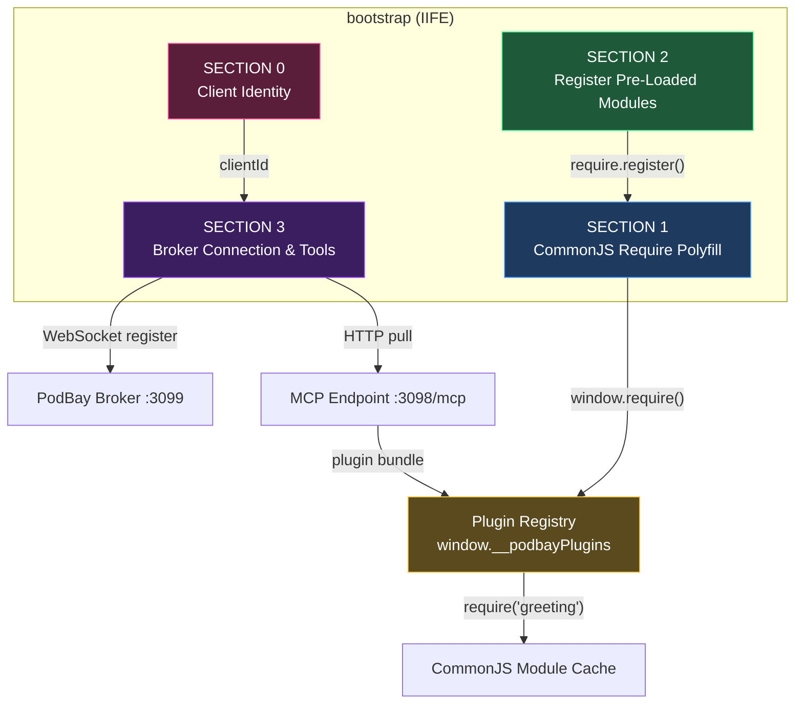
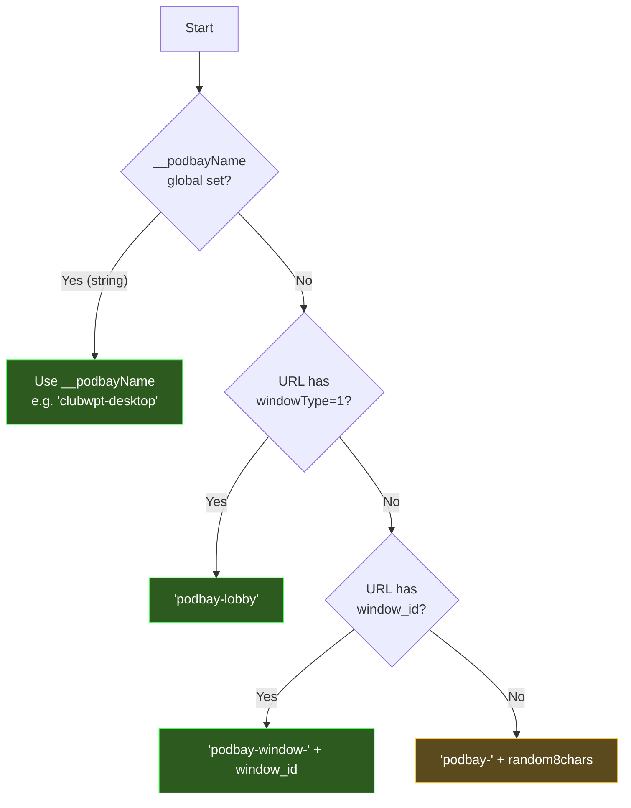
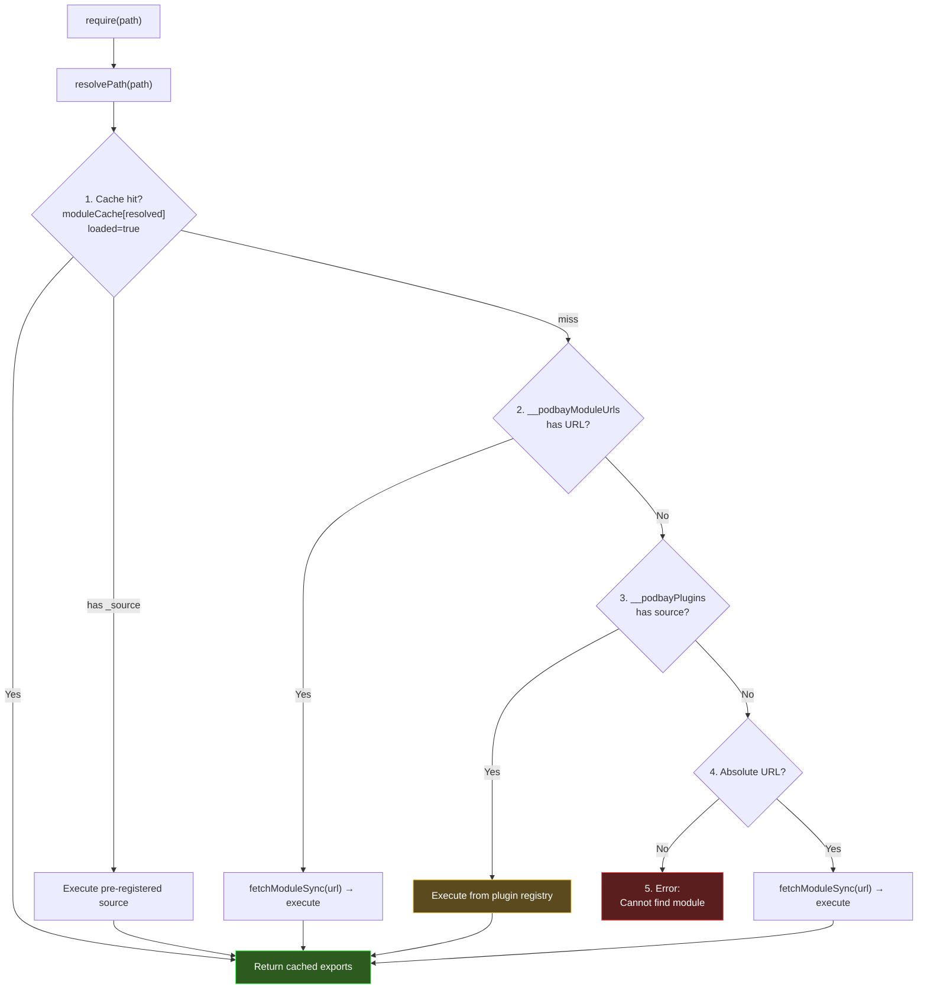
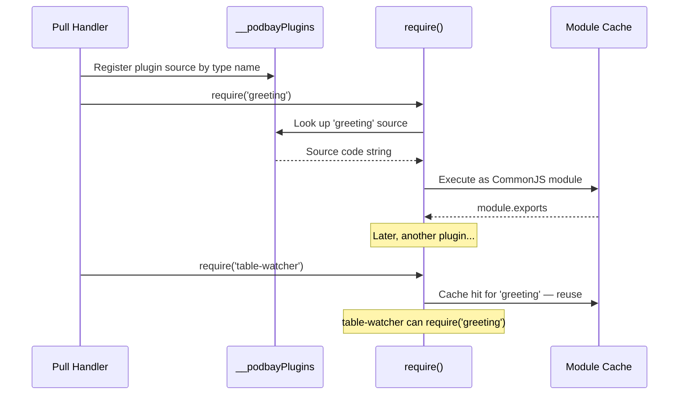
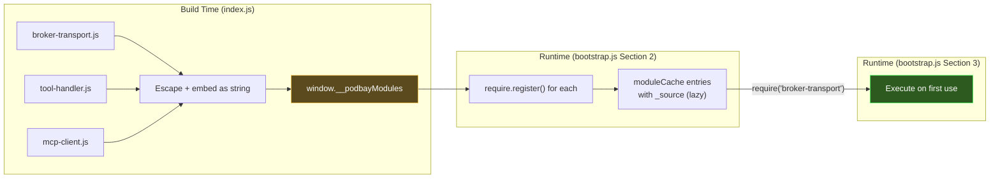
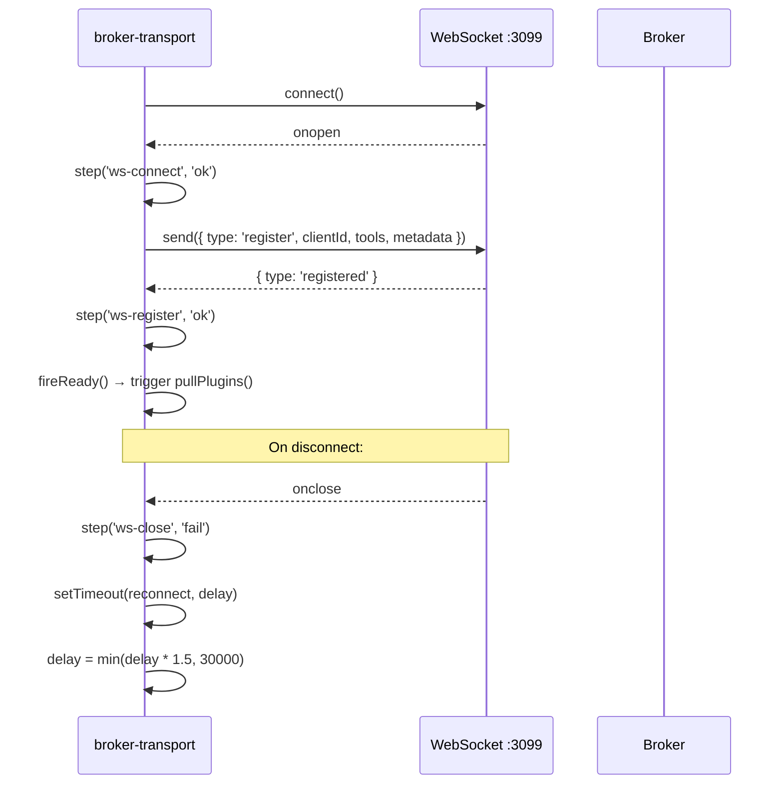
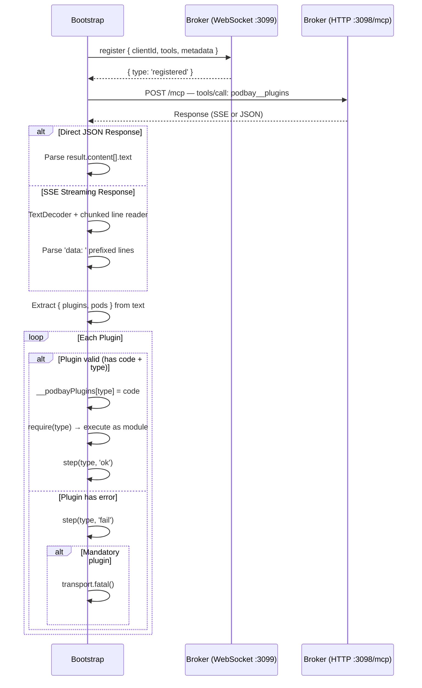
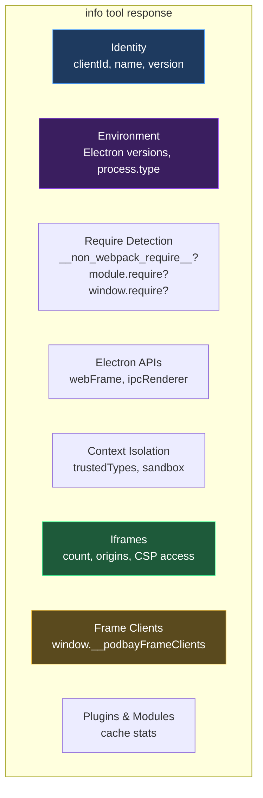
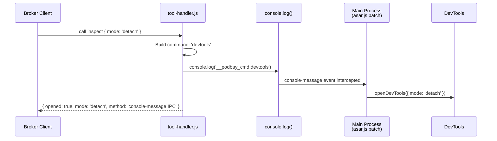

# bootstrap.js (PodBay) — Developer's Guide

## Summary

The PodBay `bootstrap.js` is a **unified bootstrap-and-module-system payload** injected into Electron renderer windows via the ASAR patch. Unlike the original bootstrap (which only connects to the broker and waits for remote code pushes), this version **embeds a full CommonJS `require()` polyfill** directly into the payload — making `require()` available from the very first line of any plugin.

This is the central innovation of the PodBay: plugins are no longer anonymous script fragments evaluated in isolation. They are **CommonJS modules** that can `require()` each other by type name, export values, and compose naturally. The bootstrap also adopts a **pull model** — after registering with the broker, it proactively requests its plugins via HTTP/MCP rather than waiting for the broker to push them.

### What Changed from Original

| Aspect | Original `bootstrap.js` | PodBay `bootstrap.js` |
|--------|------------------------|------------------------|
| Module system | None — plugins are raw `eval`'d scripts | Full CommonJS `require()` embedded |
| Plugin delivery | Broker pushes via `execute` tool calls | Bootstrap **pulls** via HTTP/MCP after registration |
| Plugin isolation | Each plugin runs in its own `<script>` tag | Plugins are modules in a shared registry — can `require()` each other |
| Code execution | DOM script injection | Indirect `eval` (CSP-compatible) |
| Tools registered | `execute`, `info` | `execute`, `info`, `inspect` |
| Diagnostics | Basic `console.log` | Structured **step log** with timestamps and status icons |
| DevTools access | Not provided | `inspect` tool via console-message IPC to main process |



---

## Detailed Implementation

### Section 0: Client Identity

Before anything else, the bootstrap derives a unique `clientId` for this window. This identity is used for broker registration and determines how the window appears to other clients.



| Priority | Source | Example Result |
|----------|--------|----------------|
| 1 | `__podbayName` global (set by ASAR assembler) | `'clubwpt-desktop'` |
| 2 | URL `?windowType=1` | `'podbay-lobby'` |
| 3 | URL `?window_id=X` | `'podbay-window-X'` |
| 4 | Random fallback | `'podbay-k7x2m9p1'` |

The `__podbayName` global is injected by `index.js` before the bootstrap runs. When the ASAR assembler calls `patchWindowManager(dir, payload, resourcesDir, name, frameClients)`, the `name` parameter becomes a `var __podbayName = "..."` prefix line prepended to the bootstrap payload. For frames, the frame injector in `asar.js` sets `__podbayName` to the unique frame client name (e.g., `clubwpt-frame-login-1`).

### Section 1: Embedded CommonJS Require Polyfill

The polyfill provides a browser-compatible `require()` that mimics Node.js module loading. It is installed onto `window` before any broker connection or plugin code runs.

#### Module Resolution Pipeline

When `require('some-module')` is called, the loader first passes the path through `resolvePath()`, then checks five resolution strategies in order:



| Strategy | Source | Purpose |
|----------|--------|---------|
| **Cache hit** | `moduleCache[id]` with `loaded: true` | Avoid re-execution; standard CommonJS semantics |
| **Pre-registered source** | `moduleCache[id]._source` exists | Lazy execution of modules registered via `require.register()` |
| **Module URL registry** | `window.__podbayModuleUrls[id]` | Dynamic modules fetched at runtime (pod system `cache: false`) |
| **Plugin registry** | `window.__podbayPlugins[id]` | Plugins registered by type name and loaded on demand |
| **URL fetch** | `fetchModuleSync(url)` via sync XHR | Direct URL imports for external/CDN modules |

#### Module Execution Wrapper

Each module's source is wrapped in the standard CommonJS factory function:

```js
(function(exports, require, module, __filename, __dirname) {
  // ... module source ...
})
```

The wrapper provides:
- **`exports`** and **`module`** — Standard CommonJS export surface
- **`require`** — A **bound child require** scoped to the current module's path (enables correct relative resolution)
- **`__filename`** / **`__dirname`** — Derived from the resolved URL

A **module stack** (`moduleStack` array) tracks the current execution chain, enabling correct relative path resolution for nested `require()` calls.

**Error recovery**: If module compilation (via `Function()`) or runtime execution throws, the module is **deleted from cache** (`delete moduleCache[mod.id]`) before re-throwing. This ensures failed modules don't remain partially loaded — subsequent `require()` calls will re-attempt execution.

#### Plugin Registry Integration

This is what makes plugins composable:



When the pull handler receives plugins, it stores each plugin's code in `window.__podbayPlugins` keyed by type name, then immediately calls `require(typeName)`. Subsequent plugins can `require()` previously loaded plugins by their type name — enabling **inter-plugin dependencies** without explicit wiring.

If a plugin has `p.error` or is missing `p.code`/`p.type`, it is skipped. If a **mandatory** plugin fails to load, `transport.fatal()` is called — which sets `document.title = 'PODBAY FATAL: ...'` and halts execution.

#### Require API Extensions

| Method | Purpose |
|--------|---------|
| `require(path)` | Load and return module exports |
| `require.resolve(path)` | Resolve path without loading |
| `require.cache` | Direct access to module cache object |
| `require.clear()` | Flush all cached modules |
| `require.stats()` | Return `{ cached, modules }` — count and list of cached module IDs |
| `require.register(id, source)` | Pre-register a module for lazy execution (source stored as `_source`) |

### Section 2: Register Pre-Loaded Modules

The `index.js` assembler embeds three module source files into the bootstrap payload as `window.__podbayModules`:

```js
// Generated by index.js buildBootstrapPayload()
window.__podbayModules = {
  'broker-transport': '...escaped source...',
  'tool-handler':     '...escaped source...',
  'mcp-client':       '...escaped source...'
};
```

At boot, Section 2 iterates `window.__podbayModules` and calls `require.register(name, source)` for each. This makes them available for lazy loading — the modules are **not executed until first `require()` call**.



### Section 3: Broker Connection & Plugin Pull

#### Step Log (Diagnostics)

Every significant action is recorded as a structured **step** object:

```js
{ step: 'ws-connect', status: 'ok', detail: 'connected to ws://localhost:3099', ts: '2026-03-20T...' }
```

Steps are logged to the console with status icons (`✓` ok, `✗` fail, `⊘` skip, `→` start) and accumulated in the `_steps` array, accessible via the `info` tool or `window.__podBay.steps()`.

#### Connection & Registration

The broker-transport module manages WebSocket connection to `ws://localhost:3099` with automatic reconnection:

- **Initial reconnect delay**: 3000ms
- **Backoff formula**: `Math.min(delay * 1.5, 30000)` — grows to max 30 seconds
- **Fatal timeout**: If the broker is unreachable after the configured timeout, `transport.fatal()` sets `document.title = 'PODBAY FATAL: ...'` and halts

After connection, the transport registers with the broker (clientId, tools, metadata). On `registered` confirmation, immediately calls `pullPlugins()`.



#### Pull Model



Instead of waiting for the broker to push code via `execute` tool calls, the bootstrap **pulls** its plugins immediately after registration:

1. Sends a JSON-RPC request to `http://localhost:3098/mcp` calling `podbay__plugins` with the `clientId`
2. Handles both **SSE streaming** (TextDecoder + chunked line reader parsing `data:` prefixed lines) and **direct JSON** response formats
3. Parses the MCP result to extract `{ plugins: [...], pods: [...] }` from `result.content[].text`
4. Validates each plugin — skips entries missing `code` or `type`
5. Registers each plugin's code in `__podbayPlugins` by type name
6. Calls `require(type)` to execute each plugin as a CommonJS module
7. Mandatory plugins that fail trigger `transport.fatal()`

### Tools

The bootstrap registers three tools with the broker: `execute`, `info`, and `inspect`.

#### `execute` Tool

Runs arbitrary JavaScript in the renderer's global scope.

**Input Schema:**
```json
{
  "code": { "type": "string", "description": "JavaScript code to execute" },
  "useIIFE": { "type": "boolean", "description": "Wrap in IIFE (default: true)" }
}
```

Uses **indirect eval** instead of DOM script injection:

```js
var execCode = useIIFE ? '(function(){' + code + '\n})();' : code;
(0, eval)(execCode); // indirect eval — runs in global scope
```

This is necessary because Electron's Content Security Policy (CSP) may block dynamically inserted `<script>` tags, but indirect eval (`(0, eval)(...)`) runs in global scope and bypasses this restriction.

**Result object:**
```js
{
  result: 'executed',
  codeLength: code.length,        // Size of injected code
  returnValue: evalResult,         // Serialized return value (JSON.stringify fallback to String)
  pluginsRegistered: [...],        // Already-loaded plugin type names
  requireStats: { cached, modules }, // Module cache stats
  errors: [...]                    // Array of { message, source, line, col } if any
}
```

#### `info` Tool

Returns comprehensive metadata about the renderer environment. No input parameters.

**Result includes:**
- Client identity (`clientId`, `name`)
- Bootstrap version and type
- URL and document title
- **Electron/Node detection**: `process.versions.node`, `.electron`, `.chrome`, `process.type`
- **Require system detection**: checks for `__non_webpack_require__`, `module.require`, standard `require`
- **Electron API detection**: `electron.webFrame`, `electron.ipcRenderer`
- **Context isolation detection**: `window.trustedTypes`
- **Full iframe inventory** with cross-origin CSP access checks
- **Frame client registry**: `window.__podbayFrameClients` contents (if running in parent renderer)
- Plugin and module cache stats



#### `inspect` Tool

Opens Chrome DevTools via the **console-message IPC bridge** — the renderer sends a command to the main process, which handles the actual DevTools API call.

**Input Schema:**
```json
{
  "mode": {
    "type": "string",
    "enum": ["detach", "right", "bottom", "close"],
    "default": "detach"
  }
}
```

**Mechanism:**



The tool does **not** attempt to open DevTools from the renderer directly. Instead, it logs a `__podbay_cmd:` prefixed message which the main process intercepts via the `console-message` event listener (installed by the `asar.js` patch). This approach works regardless of:
- Context isolation settings
- Missing `electron.remote`
- Missing contextBridge preloads

| Mode | Console Command | Action |
|------|----------------|--------|
| `detach` (default) | `__podbay_cmd:devtools` | Open DevTools in detached window |
| `right` | `__podbay_cmd:devtools_right` | Dock DevTools to right |
| `bottom` | `__podbay_cmd:devtools_bottom` | Dock DevTools to bottom |
| `close` | `__podbay_cmd:devtools_close` | Close DevTools |

### Public API

```js
window.__podBay = {
  clientId: clientId,                          // Derived window identity
  ws: function() { return transport.ws(); },   // WebSocket reference (via transport)
  steps: function() { return transport.steps(); } // Full step log (via transport)
};
```

The `ws()` and `steps()` methods delegate to the `broker-transport` module rather than accessing globals directly.
