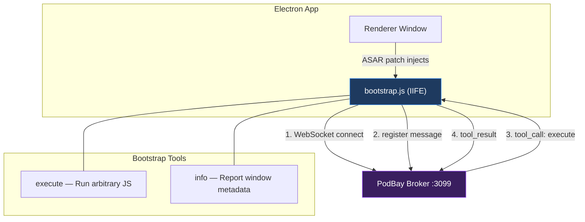
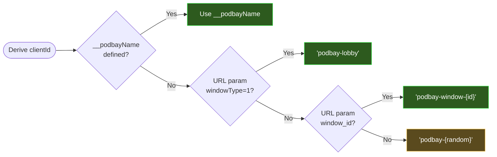
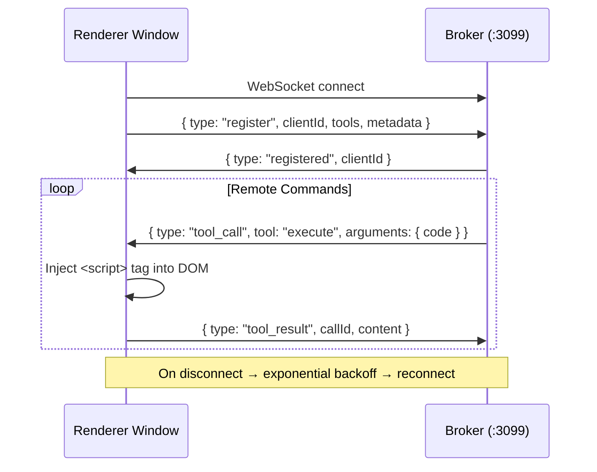
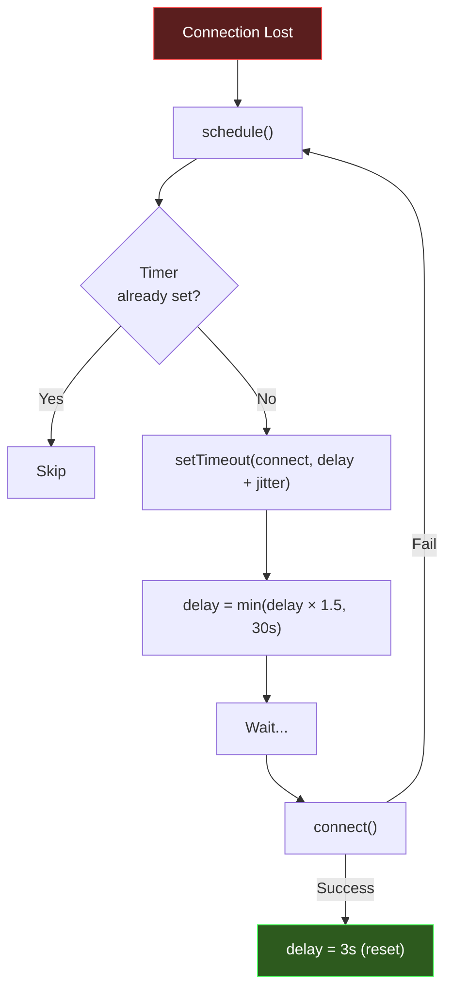

# bootstrap.js — Developer's Guide

## Summary

`bootstrap.js` is the **minimal entry point** injected into every Electron renderer window via the ASAR patch. Its sole purpose is to make the window **remotely scriptable** through the PodBay broker.

Think of it as a tiny radio receiver installed in each window: it tunes into the broker's WebSocket frequency, announces itself, and then listens for commands. Everything else — plugin loading, tool registration, advanced functionality — is **pushed remotely** by the broker after bootstrap connects.

### Key Concepts

- **Single Responsibility**: Connect to broker, accept remote `execute` commands. Nothing more.
- **Self-Identifying**: Each window derives a stable `clientId` from context (injected name, URL params, or random fallback).
- **Resilient**: Auto-reconnects with exponential backoff on disconnect.
- **Minimal Surface**: Exposes only two tools — `execute` (run JS) and `info` (report status).



---

## Detailed Implementation

### Guard: Single Installation

```js
if (window.__podBayInstalled) return;
window.__podBayInstalled = true;
```

The entire file is wrapped in an IIFE. The `__podBayInstalled` flag prevents double-injection if the script runs more than once in the same window context.

### Client Identity Derivation



The identity is resolved in priority order:

1. **`__podbayName`** — Injected by the ASAR patch's `patchWindowManager()`. This is the preferred stable name (e.g., `"clubwpt-desktop"`).
2. **URL param `windowType=1`** — Identifies the lobby window specifically.
3. **URL param `window_id`** — A game/table window with a known ID.
4. **Random fallback** — Last resort; generates `podbay-XXXXXXXX`.

### WebSocket Connection Lifecycle



**`connect()`** establishes the WebSocket and sends a `register` message containing:
- `clientId` — The derived identity
- `tools` — Array of tool definitions (`execute`, `info`) with JSON Schema input specs
- `metadata` — Current URL, document title, clientId

### Tool Handling

#### `execute` Tool

Receives a `code` string and optionally `useIIFE` (default `true`). Execution happens via **DOM script injection**:

```js
var s = document.createElement('script');
s.textContent = useIIFE ? '(function(){' + code + '\n})();' : code;
document.documentElement.appendChild(s);
s.remove();
```

This runs code in the **renderer main world** — the same JS context as the Electron app. The script tag is immediately removed after injection. This approach ensures the code has full access to `window`, globals, and frameworks like `cc` (Cocos2d).

#### `info` Tool

Returns a snapshot of the window's current state:
- `clientId`, `url`, `title`, `userAgent`
- Whether `__podBay` is installed and WebSocket status
- ISO timestamp

### Reconnection Strategy



- **Initial delay**: 3 seconds
- **Growth**: Multiplied by 1.5 on each failure
- **Cap**: 30 seconds maximum
- **Jitter**: Random 0–1 second added to prevent thundering herd
- **Reset**: Delay resets to 3s on successful connection

### Public API

```js
window.__podBay = { clientId: clientId, ws: function () { return ws; } };
```

A minimal public surface that plugins and external code can query. The `ws()` function returns the raw WebSocket (or `null` if disconnected), allowing injected plugins to check connectivity without re-establishing their own connections.
