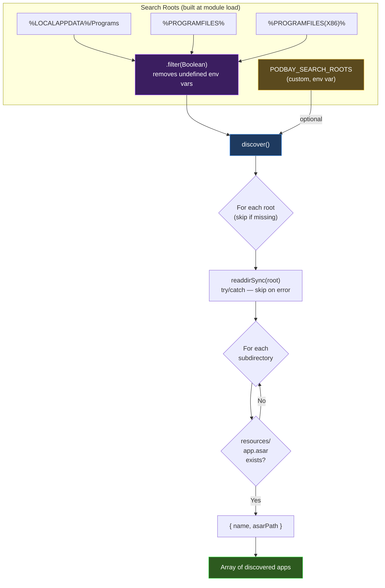
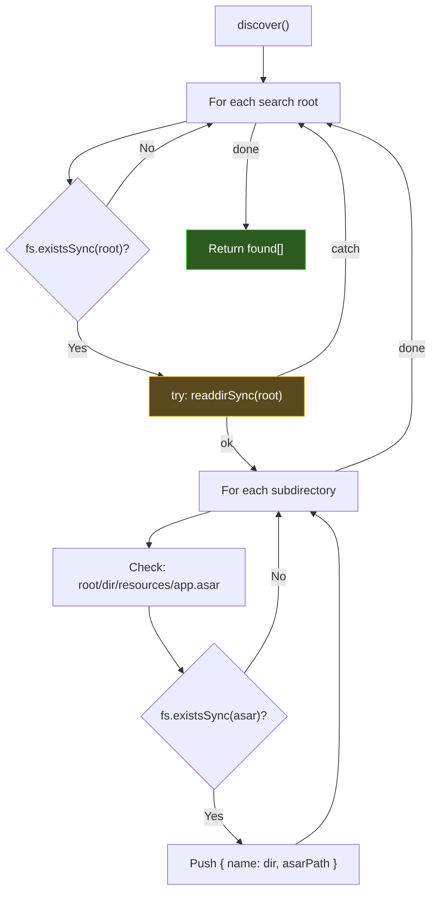
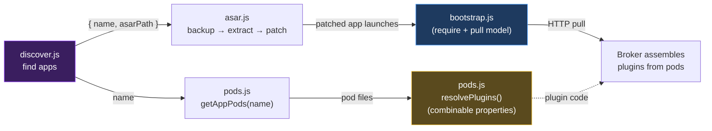

# discover.js (PodBay) — Developer's Guide

## Summary

`discover.js` is the **Electron application scanner**. It searches known installation directories on the host system for Electron apps that contain an `app.asar` file, identifying them as candidates for PodBay injection.

This version is **identical to the original** — discovery logic doesn't change between the standard and next-gen plugin systems. The same apps are found; only what happens *after* discovery (patching, bootstrap, plugin loading) differs.

### Key Concepts

- **Convention-Based Discovery**: Scans standard Windows install paths without manual configuration.
- **Extensible Roots**: Custom paths added via the `PODBAY_SEARCH_ROOTS` environment variable.
- **Pipeline Entry Point**: Returns `{ name, asarPath }` tuples that feed directly into `asar.js` for patching and `pods.js` for app-pod assignment.
- **Fault-Tolerant**: Undefined environment variables are filtered out, and unreadable directories are silently skipped.



---

## Detailed Implementation

### Search Root Construction

Built at module load time from environment variables:

| Source | Typical Path | What's There |
|--------|--------------|--------------|
| `%LOCALAPPDATA%\Programs` | `C:\Users\<user>\AppData\Local\Programs` | Per-user installs (VS Code, Discord, etc.) |
| `%PROGRAMFILES%` | `C:\Program Files` | 64-bit system installs |
| `%PROGRAMFILES(X86)%` | `C:\Program Files (x86)` | 32-bit installs on 64-bit Windows |
| `PODBAY_SEARCH_ROOTS` | Any custom paths | Docker mounts, dev builds, portable installs |

The three environment variables are collected into an array and filtered with `.filter(Boolean)` — any undefined env var (e.g., `LOCALAPPDATA` not set) is silently removed rather than causing errors.

Custom roots use **separator detection**: if the string contains `;`, it splits on `;`; otherwise it splits on `,`. Only one separator is used per invocation — they are not mixed. Each segment is trimmed and empty strings are filtered out before appending to the search list.

### Discovery Algorithm



The scan is **one level deep** — matching the standard Electron install layout. The `readdirSync` call is wrapped in a `try/catch` that silently skips roots where reading fails (permissions, broken links, etc.):

```
%LOCALAPPDATA%\Programs\
├── clubwpt-desktop/
│   └── resources/
│       └── app.asar    ← discovered
├── some-other-app/
│   └── resources/
│       └── app.asar    ← discovered
└── non-electron-tool/
    └── (no resources/)  ← skipped
```

### Integration: PodBay Pipeline



1. **discover.js** finds Electron apps and returns names + ASAR paths
2. **asar.js** patches `WindowManager.js` with menu bar, DevTools shortcuts, and bootstrap injection
3. **pods.js** resolves the app's assigned pods into combined plugin code (using combinable `require`/`file`/`code` properties)
4. **bootstrap.js** (PodBay) — at runtime, the embedded `require()` polyfill loads, then pulls plugins via HTTP/MCP and registers them as CommonJS modules

### Exports

| Export | Purpose |
|--------|---------|
| `discover()` | Scan and return all Electron apps containing `app.asar` |
