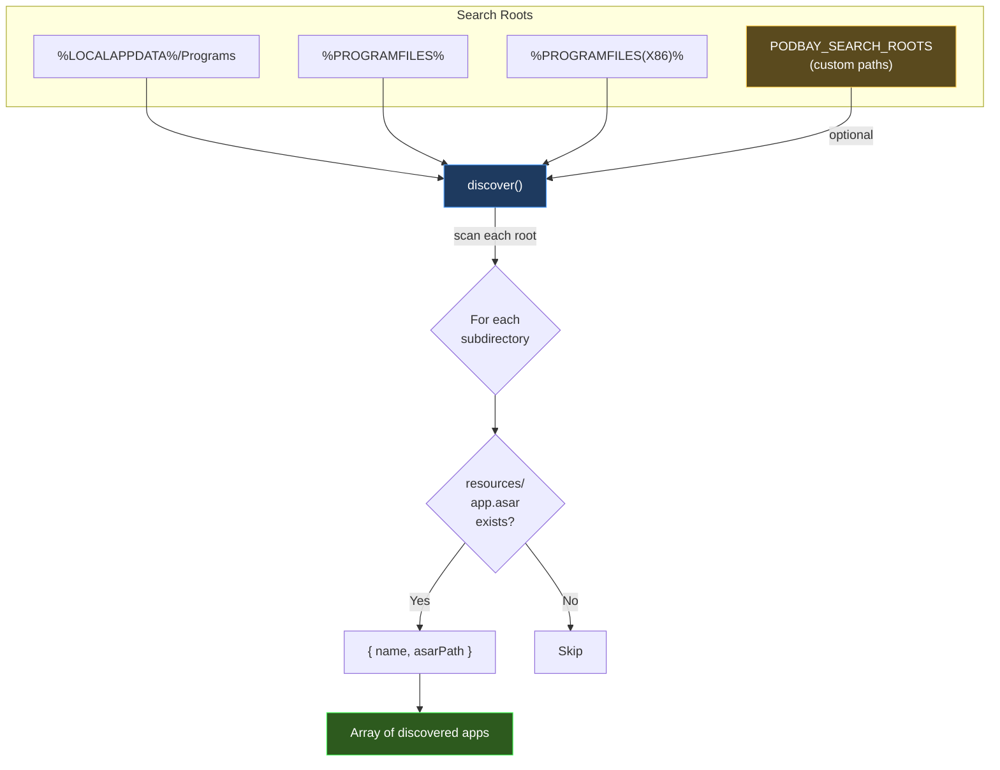
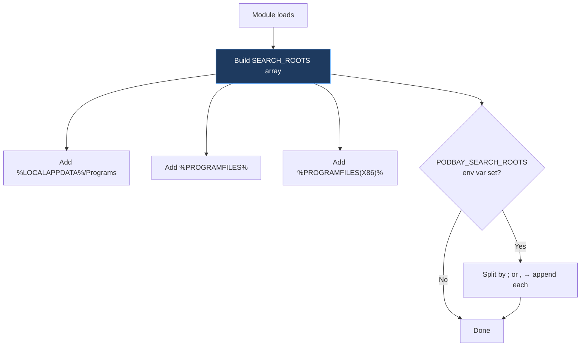
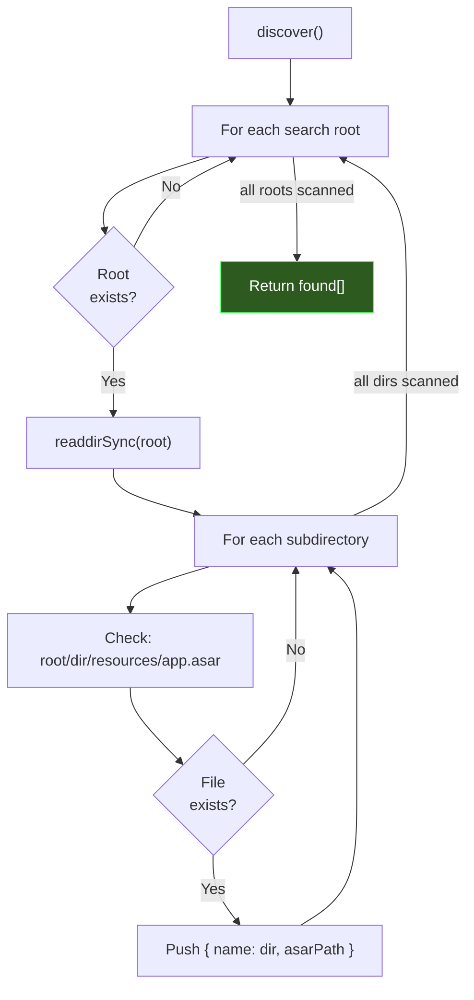
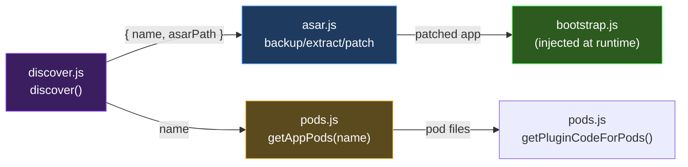

# discover.js — Developer's Guide

## Summary

`discover.js` is the **application scanner**. It searches known installation directories on the host system to find Electron apps that contain an `app.asar` — making them candidates for PodBay injection.

This is the first step in the PodBay workflow: before you can patch an app, you need to find it. `discover.js` automates this by scanning standard Windows program directories (and any custom paths) for the telltale `resources/app.asar` structure that identifies an Electron application.

### Key Concepts

- **Convention-Based Discovery**: Scans well-known Windows install paths — no manual configuration required for standard installs.
- **Extensible Search Roots**: Custom directories can be added via the `PODBAY_SEARCH_ROOTS` environment variable (useful for Docker mounts or non-standard install locations).
- **Minimal Output**: Returns just the app name and ASAR path — enough to feed directly into `asar.js` functions.



---

## Detailed Implementation

### Search Root Construction

The module builds its list of directories to scan at **load time** (module scope, not per-call):



#### Default Roots (Windows)

| Environment Variable | Typical Path | What's There |
|---------------------|--------------|--------------|
| `%LOCALAPPDATA%\Programs` | `C:\Users\<user>\AppData\Local\Programs` | Per-user installs (VS Code, Discord, Slack, etc.) |
| `%PROGRAMFILES%` | `C:\Program Files` | 64-bit system installs |
| `%PROGRAMFILES(X86)%` | `C:\Program Files (x86)` | 32-bit installs on 64-bit Windows |

Each is sourced from `process.env` and filtered for existence (`filter(Boolean)` removes any undefined variables).

#### Custom Roots

The `PODBAY_SEARCH_ROOTS` environment variable allows adding arbitrary paths:

```bash
# Semicolon or comma separated
PODBAY_SEARCH_ROOTS="D:\apps;E:\electron-apps"
```

This is particularly useful for:
- **Docker volume mounts** — Where the host app directory is mounted at a non-standard path
- **Development builds** — Electron apps built locally in custom directories
- **Portable installs** — Apps on external drives or non-standard locations

### The Discovery Algorithm



The algorithm is **shallow** — it only checks one level deep in each search root. This matches how Electron apps are typically installed:

```
C:\Users\<user>\AppData\Local\Programs\
├── clubwpt-desktop/          ← app directory
│   └── resources/
│       └── app.asar          ← ✓ discovered
├── Microsoft VS Code/
│   └── resources/
│       └── app.asar          ← ✓ discovered
└── some-other-tool/
    └── (no resources/)       ← ✗ skipped
```

### Return Value

```js
[
  { name: 'clubwpt-desktop', asarPath: 'C:\\Users\\...\\clubwpt-desktop\\resources\\app.asar' },
  { name: 'Microsoft VS Code', asarPath: 'C:\\Program Files\\Microsoft VS Code\\resources\\app.asar' }
]
```

Each result contains:
- **`name`** — The directory name (used as the app identifier throughout PodBay, e.g., in `app-pods.json` mapping)
- **`asarPath`** — The absolute path to `app.asar` (passed directly to `asar.js` functions)

### Error Handling

The function is defensively coded:
- Non-existent roots are silently skipped (`fs.existsSync` check)
- Unreadable directories are caught and skipped (`try/catch` around `readdirSync`)
- No errors are thrown — worst case returns an empty array

### Integration with Other Modules



`discover()` is the entry point of the full pipeline:
1. **discover.js** finds apps → returns names and ASAR paths
2. **asar.js** uses the ASAR path to backup, extract, and patch
3. **pods.js** uses the app name to look up assigned pods and resolve plugins
4. **bootstrap.js** runs inside the patched app at runtime, connecting back to the broker

### Exports

| Export | Purpose |
|--------|---------|
| `discover()` | Scan and return all Electron apps with `app.asar` |
