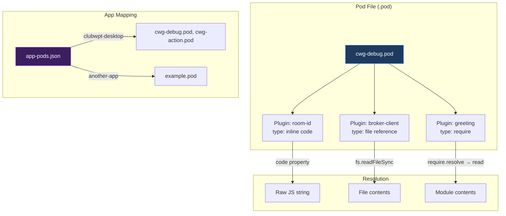
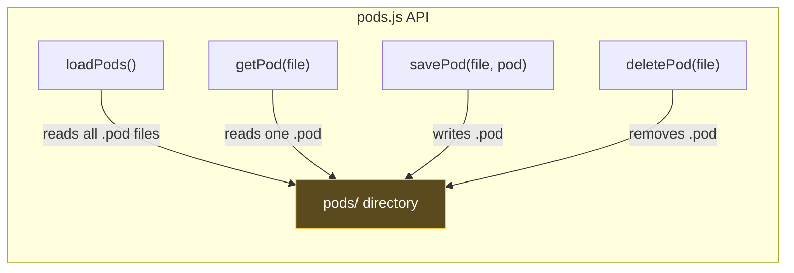
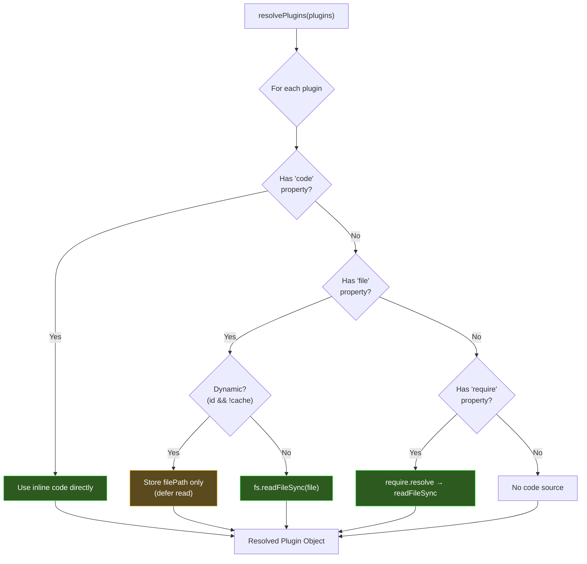
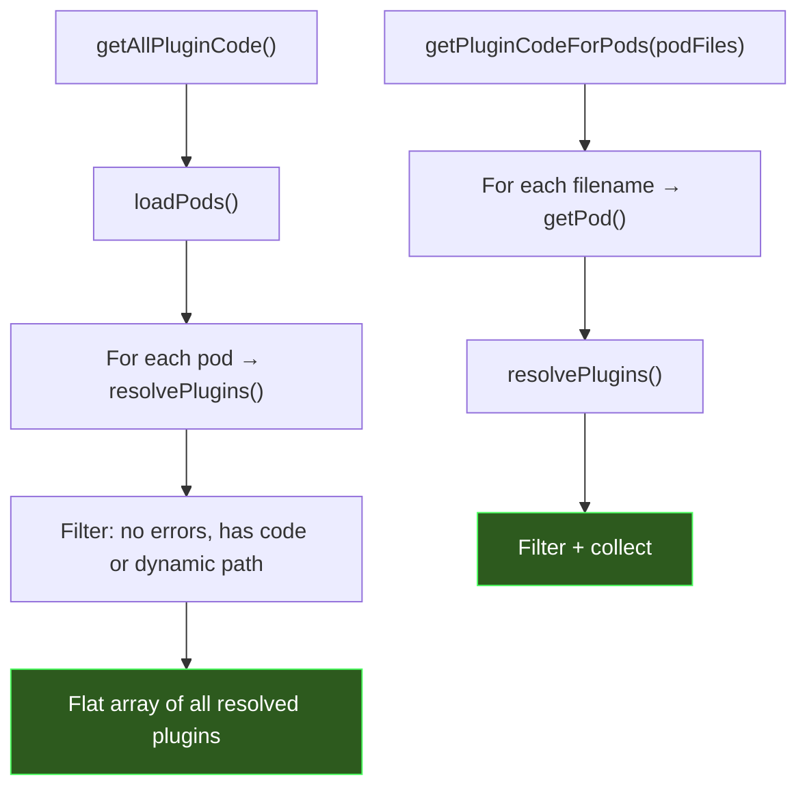
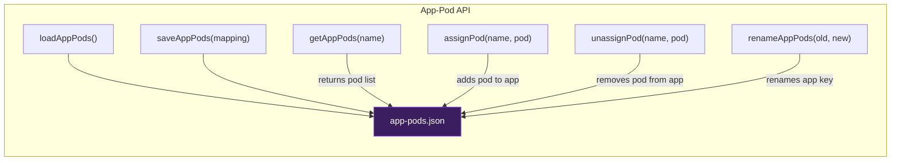

# pods.js — Developer's Guide

## Summary

`pods.js` is the **plugin packaging and resolution engine**. It manages **pods** — JSON manifest files (`.pod`) that declare which plugins should be loaded into a target application window.

A pod is a portable, self-contained plugin bundle definition. Instead of hardcoding which plugins get injected, PodBay uses pods as a layer of indirection: each pod declares its plugins, and the broker resolves and assembles the actual JavaScript at injection time. Pods can also be **assigned to apps**, so different Electron applications receive different plugin sets.

### Key Concepts

- **Pod**: A `.pod` JSON file containing a name, description, and plugin list. The atomic unit of plugin packaging.
- **Plugin Resolution**: Each plugin entry can reference code via three strategies — `require` (Node module), `file` (path), or inline `code`.
- **App-Pod Mapping**: A separate `app-pods.json` file maps application names to assigned pod filenames, enabling per-app plugin configuration.
- **Dynamic Plugins**: Plugins with an `id` and `cache: false` are resolved at injection time rather than at load time, enabling hot-reload workflows.



---

## Detailed Implementation

### Pod File Format

A `.pod` file is JSON with this structure:

```json
{
  "name": "cwg-debug",
  "description": "ClubWPT Gold debug tools",
  "plugins": [
    {
      "type": "room-id",
      "description": "Displays the room/table ID on a floating badge",
      "code": "(function() { ... })();"
    },
    {
      "type": "broker-client-sdk",
      "file": "plugins/utility/broker-client.js",
      "description": "Installs PodBayBrokerClient"
    },
    {
      "type": "greeting",
      "require": "./plugins/greeting",
      "description": "Registers a greeting tool"
    }
  ]
}
```

### CRUD Operations



| Function | Behavior |
|----------|----------|
| `loadPods()` | Reads every `.pod` file in `pods/`, parses JSON, attaches `_file` metadata. Silently skips malformed files with a console error. |
| `getPod(filename)` | Reads a single pod by filename. Returns `null` if missing or unparseable. |
| `savePod(filename, pod)` | Writes pod JSON to `pods/`. Strips the internal `_file` property before writing. Creates `pods/` directory if needed. |
| `deletePod(filename)` | Removes a `.pod` file. Returns `true` on success, `false` if not found. |

### Plugin Resolution Engine

`resolvePlugins()` is the heart of the module. It takes a pod's plugin array and produces resolved plugin objects with actual code content.



#### Resolution Strategies

| Strategy | Source | When Used |
|----------|--------|-----------|
| **Inline `code`** | `plugin.code` string | Small, self-contained plugins (e.g., UI badges, one-off scripts) |
| **`file` path** | `fs.readFileSync(plugin.file)` | Plugins stored as separate `.js` files |
| **`require` module** | `require.resolve()` → `readFileSync` | Node-style module references (resolved relative to `lib/`) |

#### Dynamic Plugins

When a plugin has both an `id` property and `cache` is not `true`, it is treated as **dynamic**:
- The file path is stored but the code is **not read** at load time
- The broker reads the file at injection time, enabling live edits without restarting
- This powers hot-reload development workflows

#### Resolved Plugin Object

```js
{
  type: 'broker-client-sdk',     // Plugin type identifier
  description: '...',             // Human-readable description
  dashboard: 'dashboard.html',   // Optional dashboard URL
  id: 'some-id',                 // Optional dynamic plugin ID
  cache: false,                  // Whether to cache code
  filePath: 'plugins/util/x.js', // Resolved file path (relative)
  code: '(function(){...})()',    // Resolved JavaScript code (or null if dynamic)
  error: null                    // Error message if resolution failed
}
```

### Aggregation Functions



- **`getAllPluginCode()`** — Loads every pod, resolves all plugins, returns the combined flat list. Used when the broker needs to inject everything.
- **`getPluginCodeForPods(podFiles)`** — Same, but scoped to specific pod filenames. Used when an app has an assigned pod set.

### App-Pod Mapping

The `app-pods.json` file maps application names (e.g., `"clubwpt-desktop"`) to arrays of pod filenames:

```json
{
  "clubwpt-desktop": ["cwg-debug.pod", "cwg-action.pod"],
  "another-app": ["example.pod"]
}
```



| Function | Behavior |
|----------|----------|
| `loadAppPods()` | Parse `app-pods.json`. Returns `{}` on any error (missing file, bad JSON). |
| `saveAppPods(mapping)` | Write the full mapping object. Creates `pods/` if needed. |
| `getAppPods(name)` | Get pod filenames for an app. Returns `[]` if unmapped. |
| `assignPod(name, podFile)` | Add a pod to an app's list (no duplicates). |
| `unassignPod(name, podFile)` | Remove a pod. Deletes the app key entirely if its list becomes empty. |
| `renameAppPods(oldName, newName)` | Move an app's pod assignments to a new key. |

### Exports

| Export | Category |
|--------|----------|
| `loadPods`, `getPod`, `savePod`, `deletePod` | Pod CRUD |
| `resolvePlugins` | Plugin resolution |
| `getAllPluginCode`, `getPluginCodeForPods` | Plugin aggregation |
| `loadAppPods`, `saveAppPods`, `getAppPods` | App mapping reads |
| `assignPod`, `unassignPod`, `renameAppPods` | App mapping writes |
| `PODS_DIR` | Base directory path constant |
