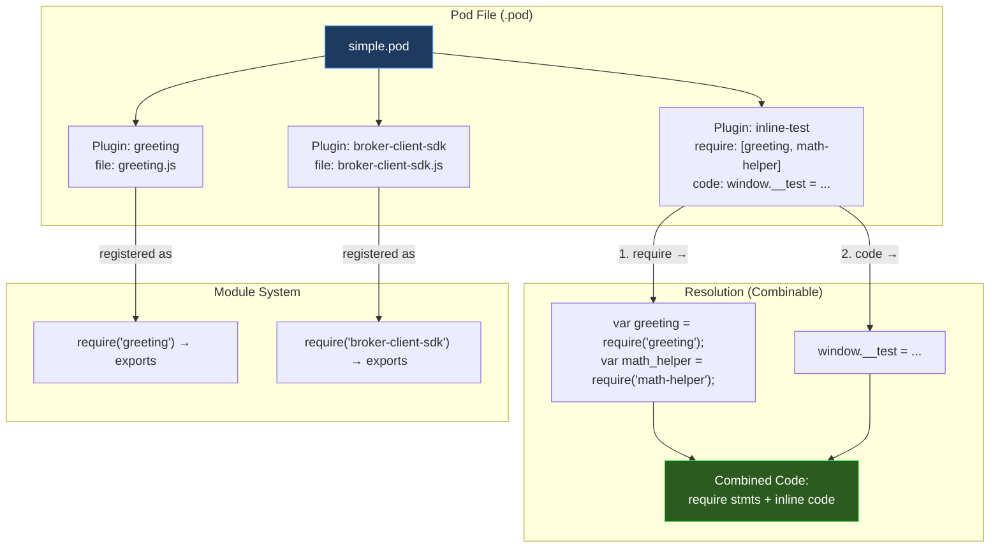
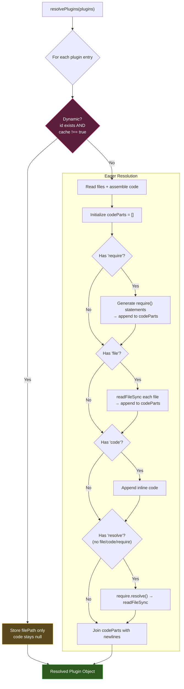
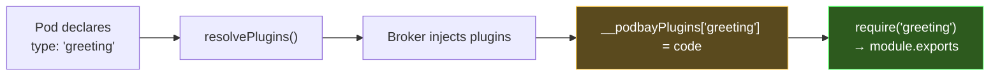
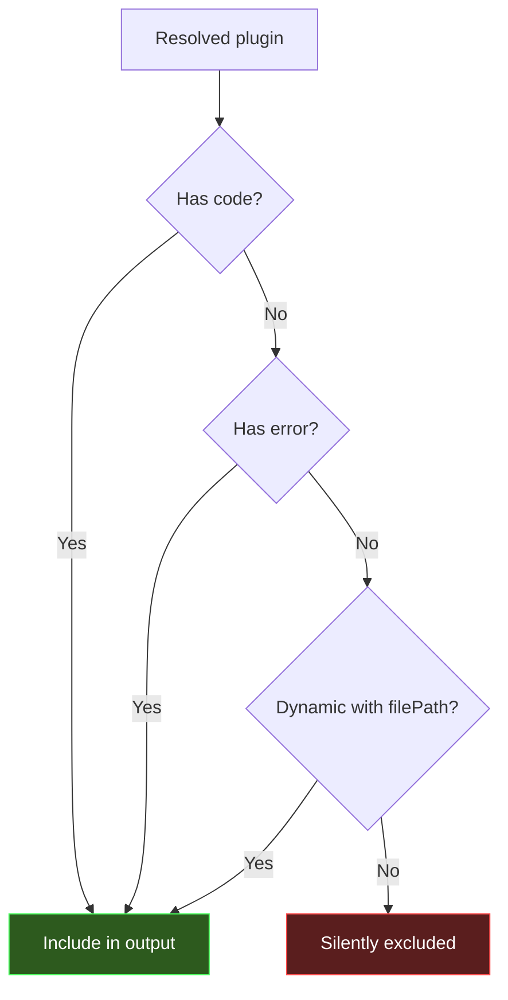
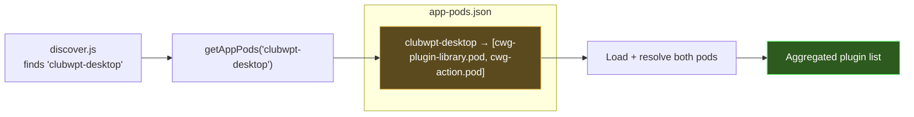

# pods.js (PodBay) — Developer's Guide

## Summary

The PodBay `pods.js` is the **plugin packaging and resolution engine**. It manages pod files (`.pod` JSON manifests), resolves their declared plugins into executable JavaScript, and maps pods to applications.

This version enhances the original's resolution engine with **combinable plugin properties**, **auto-registration by type name**, and a **dynamic/lazy-loading** mechanism — making plugins first-class CommonJS modules that can `require()` each other without explicit wiring.

### What Changed from Original

| Aspect | Original `pods.js` | PodBay `pods.js` |
|--------|--------------------|--------------------|
| Plugin properties | `code` OR `file` OR `require` (mutually exclusive) | `require` + `file` + `code` are **combinable** — assembled in order |
| `require` property | Resolves via `require.resolve()` (Node-side file lookup) | Generates **browser-side `require()` calls** (e.g., `var greeting = require('greeting')`) |
| `file` property | Single path | Accepts **string or array** of file paths |
| `code` property | Single string | Accepts **string or array** of code strings |
| `resolve` property | Does not exist | New — uses `require.resolve()` for Node-side path lookup (replaces old `require` behavior) |
| `id` field | Needed for dynamic resolution | **Optional** for naming — but also enables **dynamic/lazy-loading** when paired with `cache` |
| `cache` property | Does not exist | New — controls whether files are read at resolve time or deferred |
| `getAllPluginCode()` | Exists | Removed (not needed in POC) |
| SDK auto-prepend | Manual | `broker-client-sdk` auto-prepended if missing |

### Key Concepts

- **Pod**: A `.pod` JSON file — the atomic unit of plugin packaging.
- **Combinable Properties**: A single plugin entry can have `require` + `file` + `code` all at once; the resolved code is the concatenation in that order.
- **Type-Based Modules**: Each plugin's `type` name becomes its CommonJS module identifier. `require('greeting')` loads the plugin whose type is `"greeting"`.
- **Dynamic Plugins**: Plugins with `id` and `cache !== true` defer file reading — only the path is stored, code is loaded later by the broker.
- **App-Pod Mapping**: `app-pods.json` maps application names to pod filenames.



---

## Detailed Implementation

### Pod File Format (Enhanced)

```json
{
  "name": "Simple Plugin Test",
  "description": "Two utility modules + one consumer that requires them",
  "plugins": [
    {
      "type": "inline-test",
      "description": "Combines require + code properties",
      "require": ["greeting", "math-helper"],
      "code": "window.__test_msg = greeting.greet('Inline Plugin');"
    },
    {
      "type": "greeting",
      "file": "plugins/greeting.js"
    }
  ]
}
```

#### Plugin Entry Fields

| Field | Type | Required | Description |
|-------|------|----------|-------------|
| `type` | string | Yes | Plugin type name — becomes the CommonJS module identifier |
| `description` | string | No | Human-readable description |
| `require` | string \| string[] | No | Browser-side `require()` calls to generate |
| `file` | string \| string[] | No | File paths to read as source code |
| `code` | string \| string[] | No | Inline JavaScript code |
| `resolve` | string | No | Node.js `require.resolve()` path (fallback only) |
| `id` | string | No | Custom module name; also enables dynamic behavior with `cache` |
| `cache` | boolean | No | If `true`, forces eager file reading even with `id`. Default behavior: `id` present + `cache !== true` = dynamic |
| `mandatory` | boolean | No | If `true`, failure to load this plugin triggers `transport.fatal()` in the bootstrap |
| `dashboard` | any | No | Dashboard metadata (passed through to resolved object) |

### The Resolution Engine: `resolvePlugins()`

This is the key differentiator from the original. Plugin properties are **assembled in sequence** rather than being mutually exclusive.

#### Dynamic vs Eager Resolution

Before assembling code, the resolver checks if a plugin is **dynamic**:

```js
const isDynamic = p.id && p.cache !== true;
```

A dynamic plugin has its `filePath` stored but its files are **not read** during resolution. The code remains `null` — the broker loads it later on demand. This is the lazy-loading mechanism.



#### Assembly Order

The code parts are assembled in a fixed order that ensures dependencies are declared before usage:

| Order | Property | What It Generates | Example |
|-------|----------|-------------------|---------|
| 1 | `require` | `var <name> = require('<name>');` | `var greeting = require('greeting');` |
| 2 | `file` | File contents (one or more) | Full plugin JS source |
| 3 | `code` | Inline code (one or more) | `window.__test = greeting.greet('Hi');` |
| 4 | `resolve` | Node-resolved file contents | (fallback if no other source) |

**`resolve`** is only used when `file`, `code`, and `require` are all absent — it serves as the legacy escape hatch for Node-side path resolution.

#### File Path Resolution

Relative file paths are resolved from the **workspace root** (`lib/..`), not the pod file's directory:

```js
const workspaceRoot = path.join(__dirname, '..');
const filePath = path.isAbsolute(f) ? f : path.join(workspaceRoot, f);
```

Absolute paths are used as-is. Only the **first** file path is stored in `result.filePath` — if `file` is an array, subsequent paths are not tracked for debugging.

#### Resolved Plugin Object

Each plugin produces a structured result object:

```js
{
  type: 'greeting',           // Plugin type name
  description: 'Say hello',   // From pod (or undefined)
  dashboard: null,             // Dashboard metadata (or undefined)
  id: null,                    // Custom module name (or null)
  cache: false,                // Cache flag (false if absent)
  mandatory: false,            // Mandatory flag (false if absent)
  filePath: 'plugins/greeting.js',  // First file path (or resolved path, or null)
  code: '...',                 // Assembled code string (or null if dynamic/error)
  error: null                  // Error message string (or null if success)
}
```

#### Error Handling

The entire resolution for each plugin is wrapped in a `try/catch`. If file I/O, JSON parsing, or `require.resolve()` throws, the error is **captured in `result.error`** and the plugin is still returned (with `code: null`). Resolution does not throw — callers must check `result.error`.

#### The `require` Property (New Semantics)

In the original `pods.js`, `require` meant "use Node's `require.resolve()` to find a file." In the PodBay, it means something completely different:

```js
// Pod entry:
{ "type": "inline-test", "require": ["greeting", "math-helper"], "code": "..." }

// Generated code:
var greeting = require('greeting');
var math_helper = require('math-helper');
// ... inline code follows ...
```

The property generates **browser-side `require()` calls** that will be executed by the bootstrap's embedded CommonJS polyfill. Module names containing non-identifier characters are sanitized (`-` → `_`, etc.).

This can be a **string** (single require) or **array** (multiple requires).

#### Array-Valued Properties

Both `file` and `code` accept arrays:

```json
{
  "type": "my-plugin",
  "file": ["plugins/utils.js", "plugins/main.js"],
  "code": ["console.log('loaded');", "window.__ready = true;"]
}
```

All entries are read/appended in order.

### Auto-Registration by Type Name



Every plugin is automatically registered by its `type` name in the bootstrap's `__podbayPlugins` registry. The `id` field is only needed if you want a module name different from the type.

This means a plugin declared as `{ "type": "greeting", "file": "plugins/greeting.js" }` is automatically available as `require('greeting')` to any other plugin.

### Plugin Aggregation: `getPluginCodeForPods()`

This function takes an array of pod filenames, resolves all their plugins, and returns an aggregated list.

#### Auto-Prepend: `broker-client-sdk`

Every pod that does **not** explicitly list a plugin with `type: 'broker-client-sdk'` gets one auto-prepended:

```js
if (!hasSdk) {
  plugins = [
    { type: 'broker-client-sdk', file: 'plugins/broker-client-sdk.js' },
    ...plugins
  ];
}
```

This is a hidden dependency — even pods that don't declare it will receive the SDK as their first plugin.

#### Plugin Filtering

After resolving, plugins are included in the output only if they meet one of these criteria:

| Condition | Included? | Why |
|-----------|-----------|-----|
| `code` is non-null | Yes | Has assembled source code |
| `error` is non-null | Yes | Error needs to be reported to the client |
| Dynamic (`id && !cache`) with `filePath` | Yes | Will be loaded later by the broker |
| None of the above | **No** | Silently excluded |



### CRUD Operations

All CRUD functions operate on `.pod` JSON files in the `pods/` directory (`PODS_DIR = path.join(__dirname, '..', 'pods')`).

#### `loadPods()`

- Returns `[]` if the `pods/` directory doesn't exist
- Filters to `.pod` files only
- Parses each file as JSON and **adds a `_file` property** with the filename
- Logs parse errors but continues — returns partial results on individual file failures
- Returns an array of pod objects, each with `_file` attached

#### `getPod(filename)`

- Reads and parses a single pod file
- **Adds `_file` property** with the filename
- Returns `null` on any error (file not found, parse error) — no distinction between error types

#### `savePod(filename, pod)`

- **Strips the `_file` property** before writing (to keep saved files clean)
- Creates `pods/` directory if it doesn't exist (`{ recursive: true }`)
- Pretty-prints with 2-space indent
- Throws on write failure (no error handling)

#### `deletePod(filename)`

- Returns `false` if the file doesn't exist
- Returns `true` on successful deletion
- Throws on permission errors

### App-Pod Mapping

The `app-pods.json` file maps application names (from `discover.js`) to arrays of pod filenames:

```json
{
  "clubwpt-desktop": ["cwg-plugin-library.pod", "cwg-action.pod"],
  "some-other-app": ["example.pod"]
}
```



#### `getAppPods(name)` (exported)
- Returns `[]` if `name` is falsy or app not found
- Returns the array of pod filenames for the given app

#### `assignPod(name, podFile)` (exported)
- Creates the app entry if it doesn't exist
- Prevents duplicates (checks with `.includes()` before pushing)
- Saves `app-pods.json` after modification

#### `unassignPod(name, podFile)` (exported)
- Removes the pod from the app's list
- **Deletes the app entry entirely** if the list becomes empty
- Silent no-op if the app doesn't exist

#### `renameAppPods(oldName, newName)` (exported)
- Renames only the **key** in `app-pods.json` — does **not** rename any pod files
- Silent no-op if `oldName` doesn't exist

#### `loadAppPods()` / `saveAppPods()` (internal only)
- `loadAppPods()` returns `{}` on any error (file not found, parse error)
- `saveAppPods()` creates `pods/` directory if needed, writes JSON with trailing newline
- Neither is exported — used internally by the mapping functions

### Exports

| Export | Category |
|--------|----------|
| `loadPods`, `getPod`, `savePod`, `deletePod` | Pod CRUD |
| `resolvePlugins` | Plugin resolution (enhanced) |
| `getPluginCodeForPods` | Plugin aggregation (with SDK auto-prepend) |
| `getAppPods`, `assignPod`, `unassignPod`, `renameAppPods` | App mapping |

Not exported: `loadAppPods`, `saveAppPods` (internal), `PODS_DIR` (internal constant).
